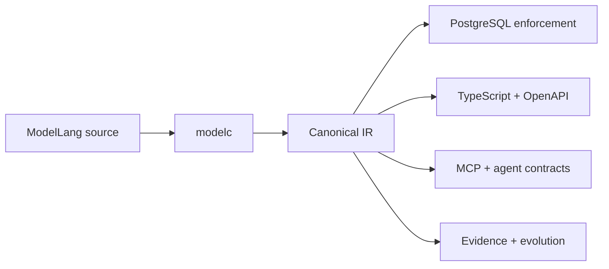

# ModelLang

ModelLang is a compiler for semantic application models. Describe your data, permissions, workflows, invariants, and transactions in one model; ModelLang generates a PostgreSQL enforcement layer, typed TypeScript interfaces, OpenAPI, and MCP tools from the same source.

The goal is simple: keep the rules enforced by your database, used by your application, and exposed to agents from drifting apart.



## What makes it different

- **Rules become enforcement.** Authorization, preconditions, invariants, workflows, and multi-entity effects compile into a PostgreSQL boundary rather than remaining advisory metadata.
- **One model serves every interface.** Database functions, TypeScript clients, HTTP handlers, OpenAPI, UI metadata, and MCP tools share the same typed operation contracts.
- **Agent access uses the application boundary.** Generated agent tools authenticate callers and re-run the same authorization and policy checks as other clients. Discovery metadata never grants authority.
- **Changes retain semantic identity.** Stable declaration IDs support deterministic generation, semantic diffs, guarded migrations, and auditable renames.

## Quickstart

ModelLang requires Node.js 20 or newer.

Create `app.model`:

```modellang
model ApprovalApp version "0.50.0";

entity User {
  id: UUID @id @generated(uuid);
  canApprove: Boolean;
}

entity Request {
  id: UUID @id @generated(uuid);
  approved: Boolean;
}

entity Approval {
  id: UUID @id @generated(uuid);
  request: Request @unique;
  actor: User;
}

action approve(caller actor: User, request: Request) -> Approval {
  authorize actor.canApprove;
  require pending: request.approved == false;
  update request { approved = true; }
  create Approval { request = request; actor = actor; }
}
```

Install the compiler, check the model, and build it:

```bash
npm install --save-dev modellang@0.50.0
npx modelc check app.model
npx modelc build app.model --out generated/app
```

The action above updates the request and creates its approval in one database transaction. The build produces a complete generated boundary:

```text
generated/app/
├── model.ir.json
├── postgres/
├── typescript/
├── openapi.json
├── operations.json
├── mcp.json
├── agent-tools.json
├── enforcement.md
└── provenance.json
```

Generated files are replaced atomically. Regenerate them from the model instead of editing them by hand.

## What you can model

ModelLang currently supports:

- entities, enums, exact money, generated values, and immutable fields;
- authenticated callers and reusable authorization policies;
- action preconditions, invariants, workflows, and ordered atomic effects;
- bounded queries with explicit projections, filters, sorting, pagination, and conditional field disclosure;
- reliable commands with caller-scoped replay protection;
- typed domain events, transactional outbox delivery, consumers, and bounded recovery;
- stable semantic identity, semantic diffs, and guarded schema evolution;
- generated HTTP, TypeScript, OpenAPI, UI, MCP, and Agent Plugin contracts; and
- private execution evidence and deterministic artifact provenance.

Two reference applications exercise the language end to end:

- [Procurement](https://github.com/atlanticplatformgroup/ModelLang/blob/v0.50.0/examples/procurement.model) covers request workflows, approval authority, reliable commands, events, recovery, caller-scoped queries, and atomic approval effects.
- [Reservations](https://github.com/atlanticplatformgroup/ModelLang/blob/v0.50.0/examples/reservations.model) covers temporal constraints, concurrent conflict prevention, event delivery, and consumer replay.

## Runtime boundary

ModelLang generates application code and database enforcement, not hosting infrastructure. A deployed application still supplies:

- PostgreSQL connectivity and migrations;
- credential verification and audience policy;
- secret management and operational monitoring;
- implementations for declared external extensions; and
- an HTTP server or framework that hosts the generated handler.

Caller identity is bound by the host and database session. It is never accepted as an action input. Application roles can execute generated operations but cannot mutate model tables directly.

The [host bootstrap guide](./docs/HOST_BOOTSTRAP.md) walks through PostgreSQL installation, least-privilege roles, JWT verification, HTTP hosting, and the MCP boundary using an installed package.

## CLI

```text
modelc check <file>
modelc build <file> --out <directory>
modelc print-ir <file>
modelc explain <file>
modelc assign-ids <file>
modelc semantic-diff <previous-ir.json> <current.model> --out <file>
modelc migration <previous-ir.json> <current.model> --out <file>
modelc reviewed-migration <previous-ir.json> <current.model> --plan <plan.json> --out <file>
```

To generate a portable Agent Plugin package for a deployed MCP endpoint:

```bash
npx modelc build app.model \
  --out generated/app \
  --agent-plugin-url https://app.example.com/mcp
```

The generated package contains connection metadata, never credentials. Authentication remains client-managed and every request still crosses the generated runtime authorization boundary.

## Public preview status

ModelLang is a pre-1.0 public preview. The current release is `0.50.0`, uses canonical IR2, and targets PostgreSQL as its enforcement backend.

It is ready for language evaluation, reference applications, and integration experiments. It is not yet a production-support commitment, a general-purpose ORM, a hosted platform, or a complete implementation of the SML-Agent or SML-Federation proposals.

Before adopting it, review the [unstable boundaries](https://github.com/atlanticplatformgroup/ModelLang/blob/v0.50.0/spec/0.50/UNSTABLE.md) and [public preview compatibility contract](https://github.com/atlanticplatformgroup/ModelLang/blob/v0.50.0/spec/0.50/PUBLIC_PREVIEW_DISTRIBUTION.md).

## Documentation

- [Public preview guide](./docs/PUBLIC_PREVIEW.md)
- [Language specification](https://github.com/atlanticplatformgroup/ModelLang/blob/v0.50.0/spec/0.50/LANGUAGE.md)
- [Atomic effects](https://github.com/atlanticplatformgroup/ModelLang/blob/v0.50.0/spec/0.50/ATOMIC_EFFECTS.md)
- [Conformance requirements](https://github.com/atlanticplatformgroup/ModelLang/blob/v0.50.0/spec/0.50/CONFORMANCE.md)
- [The Semantic Model Layer whitepaper](https://github.com/atlanticplatformgroup/ModelLang/blob/v0.50.0/docs/whitepaper/THE_SEMANTIC_MODEL_LAYER.md)
- [Security policy](https://github.com/atlanticplatformgroup/ModelLang/blob/v0.50.0/SECURITY.md)
- [Changelog](./CHANGELOG.md)

## Development

From a source checkout:

```bash
npm ci
npm run model:check
npm run model:generate
npm run db:up
npm run health
```

`npm run health` builds and lints the compiler, checks unused code and dependencies, validates evaluation fixtures, clean-installs the packed npm artifact, and runs the unit and live PostgreSQL integration suites.

Stop the disposable local database with:

```bash
npm run db:down
```

See [CONTRIBUTING.md](https://github.com/atlanticplatformgroup/ModelLang/blob/v0.50.0/CONTRIBUTING.md) for change requirements and [RELEASING.md](https://github.com/atlanticplatformgroup/ModelLang/blob/v0.50.0/RELEASING.md) for the release process.

## License

Apache-2.0. See [LICENSE](./LICENSE).
