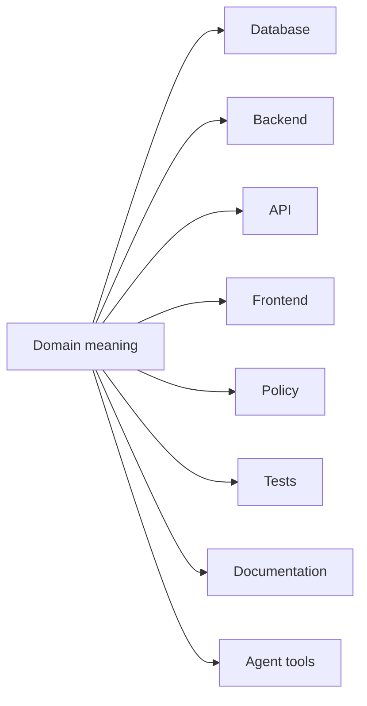
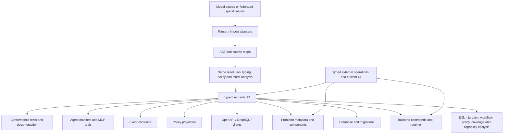

# The Semantic Model Layer

## Making application meaning a first-class, executable artifact

**Author:** Nick Scipione<br>
**Status:** Repository working draft 0.5<br>
**Date:** 2 August 2026

> ModelLang is presented as a reference implementation. The architectural proposal is intended to stand independently of any one language, compiler, or runtime.

## Implementation Status

This repository edition distinguishes the architectural target from the released reference implementation. ModelLang 0.27 is a working implementation of a bounded transactional subset of the proposal. It is not yet a conforming implementation of the complete SML-Core profile in Appendix B and does not claim the SML-Agent or SML-Federation profiles.

| Capability | ModelLang 0.27 status |
|---|---|
| Textual domain source, typed IR, stable declaration identity, invariants, actions, authorization, preconditions, queries, and workflows | Implemented |
| PostgreSQL enforcement, guarded automatic-safe and explicitly reviewed migrations, authenticated HTTP, typed clients and errors, framework-neutral UI metadata | Implemented for a bounded PostgreSQL-first profile |
| Engineering semantic manifest with policies, coverage, rules, dependencies, read sets, locks, effects, postconditions, workflows, failures, and source spans | Implemented |
| Deterministic artifact-provenance catalog and stable-ID-aware semantic change report | Implemented |
| First-class reusable policy declarations and private transactional decision evidence | Implemented for closed Boolean policies and exact action authority |
| Principal-scoped reliable commands with canonical fingerprints, committed-result replay, and private receipts | Implemented for PostgreSQL-local action effects |
| Stable typed domain events, atomic private outbox, and at-least-once lease delivery | Implemented for post-effect entity payloads and PostgreSQL-local dispatch |
| Declarative bounded publication failure policy and durable broker-neutral outbox disposition | Implemented for lease-bound private PostgreSQL failure recording; network publication, scheduling, routing, and redrive remain host-owned |
| Opt-in publication terminal recovery with isolated authority and exact private audit | Implemented as PostgreSQL-local restoration of ordinary claim eligibility; publication, message lookup/movement, and operator workflow remain host-owned |
| Stable typed event consumers, exact source contracts, and transactional inbox deduplication | Implemented for one broker-neutral PostgreSQL-local effect per consumer and event instance |
| Acyclic transactional event chains with consumer emission, correlation inheritance, and source-event causation | Implemented for local post-effect entity payloads with private producer provenance |
| Declarative bounded consumer failure policy and durable broker-neutral delivery disposition | Implemented for private PostgreSQL-local failure accounting; scheduling, acknowledgement, and queue movement remain host-owned |
| Opt-in manual terminal-failure recovery with isolated authority and exact private audit | Implemented for one PostgreSQL-local consumer/event identity; broker redelivery and operator workflow remain host-owned |
| Separately authorized terminal publication and consumer failure observation | Implemented as a bounded, cursor-based, minimally projected, privately audited PostgreSQL-local server contract; public and agent-facing operations remain absent |
| Authored semantic presentation hints and typed external operations | Partial or proposed |
| Filtered public capability contract and authenticated, side-effect-free action applicability from one enforcement decision plan | Implemented for the bounded PostgreSQL-first profile |
| General authorization-filtered resource views, full decision traces, delegated capabilities, and agent planning | Proposed; not implemented |
| Context packages, cross-context translations, sagas, and federation governance | Research-stage; not implemented |
| Comparative productivity, defect, adoption, or agent evidence | Not established |

The implementation has several independent version axes:

| Axis | Current value | Meaning |
|---|---|---|
| Compiler release | 0.27.0 | Toolchain and generated-artifact release |
| Canonical IR | IR18 | Typed backend boundary with explicit event publication recovery policy; IR9 through IR17 remain evolution baselines |
| Example source models | Procurement 0.27.0; Reservations 0.27.0 | Domain-model evolution versions, independent of compiler release |
| Operation manifest | v4 | Static transport-neutral public operation, reliability, and event-effect contract |
| UI manifest | v4 | Static framework-neutral presentation, reliability, and event-effect contract |
| Enforcement decision plan | v2 | Internal policy- and expression-bearing plan shared by applicability and execution |
| Public capability manifest | v3 | Filtered, expression-free action-applicability, reliability, and event-effect contract that grants no authority |
| Engineering semantic manifest | v10 | Full static semantic closure plus event publication failure/recovery, policy, reliability, consumer effect, failure/recovery-policy, and downstream emission semantics for trusted engineering consumers |
| Event manifest | v5 | Stable typed event, exact local/imported source contract, static publication failure/recovery policy, action/consumer producer identity, and private at-least-once envelope-v2 delivery profile |
| Semantic diff | v11 | Stable-ID policy-, reliability-, event-publication/recovery-, consumer-, event-chain-, failure-, and recovery-policy-aware change analysis that names separate guarded migration authorities |
| Reviewed migration plan and provenance | v1 | Independently versioned evolution-intent and build-assurance contracts |

These distinctions are intentional. A compiler upgrade need not change a domain model, IR schema, HTTP contract, or UI schema.

## Abstract

Software architecture commonly treats the database, service layer, API, user interface, policy engine, tests, documentation, and agent tools as separate concerns. Each artifact contains a partial restatement of the same domain. A purchase-approval threshold, for example, may appear in backend conditionals, user-interface visibility rules, policy middleware, test fixtures, workflow diagrams, and prose. Because none of these representations is necessarily authoritative, application meaning becomes fragmented and must be reconstructed from implementation details.

This paper proposes the **semantic model layer**: a versioned, typed, executable representation of a bounded application domain that defines concepts, stable identity, relationships, valid states, permitted transitions, policies, queries, events, effects, and presentation intent. The layer is architectural rather than necessarily a runtime service. A complete implementation could translate it into database schemas and migrations, backend handlers, API contracts, frontend metadata, policy checks, agent tools, tests, and documentation. The status table above identifies the smaller subset implemented by ModelLang 0.27.

The proposal belongs to the lineage of Domain-Driven Design, model-driven engineering, ontology engineering, schema-first interfaces, policy as code, and semantic layers. It does not claim that a new syntax is intrinsically better for AI agents than every possible combination of OpenAPI, policy definitions, and state-machine specifications. A sufficiently integrated bundle of those artifacts could provide equivalent semantics. The architectural claim is that applications benefit from a **referentially closed, identity-preserving semantic representation** from which those partial contracts are generated or into which they are compiled.

AI agents strengthen the economic case because they are dynamic consumers of application capabilities: they must determine what an operation means, whether it is currently applicable, what facts are needed to authorize it, and what state will result. However, agents are only one reason the timing may be favorable. Text-first language tooling, version control, mature schema standards, policy engines, component systems, migration frameworks, conformance testing, and standardized agent protocols reduce several—but not all—costs that undermined earlier model-driven efforts.

This paper presents an architectural and research proposal, not a validated architecture. The repository contains engineering feasibility evidence, but no pilot data, comparative study, production telemetry, or longitudinal adoption evidence. The paper therefore distinguishes established observations, implemented or illustrated mechanisms, and hypotheses that require controlled evaluation. It also engages directly with the history of model-driven architecture and fourth-generation tools, surfaces policy defects found in the reference model, and proposes a concrete mechanism for federation and cross-context processes.

## Executive Summary

Applications already contain a business model. The problem is that the model is usually implicit and distributed. Database tables define structure; service code defines behavior; middleware defines authorization; APIs define external shapes; frontends redefine validation and available actions; tests and documentation contain further interpretations. As the application evolves, these interpretations can diverge.

The semantic model layer makes that implicit model explicit. It is a first-class source artifact that uses the domain's ubiquitous language and defines the system in terms of entities, relationships, state, actions, invariants, policies, workflows, queries, events, effects, and semantic presentation hints. A compiler analyzes the model and produces target-specific projections. The model states what the application means and what must remain true; generators decide how those semantics are implemented on a particular stack.

The proposal is deliberately narrower than a new general-purpose programming language. The core should remain declarative and analyzable, with no unrestricted loops or recursion. Complex algorithms remain in typed external operations or handwritten extensions. Generated outputs should be disposable, while stable semantic identifiers preserve identity through renames, migrations, and cross-target projections.

The strongest version of the thesis is not that every concern must be authored in one `.model` file. A semantic model layer may be authored directly in a DSL such as ModelLang, or assembled from several standards—OpenAPI, JSON Schema, policy definitions, event contracts, and workflow descriptions—provided those artifacts are linked by stable identity and compiled into one coherent semantic intermediate representation.

| Question | Position |
|---|---|
| Is this another runtime tier? | Not necessarily. It is primarily a compile-time and design-time layer, although an authorization-aware runtime registry can expose it for inspection and agents. |
| Is it an ORM or database schema? | No. Data structure is one projection; the model also contains behavior, policy, valid state, workflow, effects, and machine-readable intent. |
| Is it an ontology? | Partly. The ontology supplies concepts and relationships, but the application model also defines transactions, permissions, effects, and lifecycle. |
| Is it model-driven engineering? | Yes, in lineage. The narrower proposal is textual, bounded-context-oriented, identity-preserving, progressively adoptable, and designed around disposable projections and explicit extensions. |
| Is it automatically correct? | No. A model can encode a misunderstanding consistently. Its advantage is that omissions and contradictions become centralized, reviewable, testable, and potentially lintable. |
| Does it replace handwritten code? | No. It generates repeatable infrastructure and constrains extensions; domain-specific algorithms and bespoke experiences remain explicit code. |
| Why now? | Modern contract standards and tooling lower integration costs, while agents create a new operational consumer of domain semantics. The organizational risks identified by earlier MDE research remain. |
| Is the architecture validated? | No. This document is a design and evaluation proposal. Its hypotheses must be tested against conventional implementations and integrated multi-spec alternatives. |

## Contents

1. [The problem: application semantics are fragmented](#1-the-problem-application-semantics-are-fragmented)<br>
2. [Definition and scope](#2-definition-and-scope)<br>
3. [Intellectual lineage and the proposed synthesis](#3-intellectual-lineage-and-the-proposed-synthesis)<br>
4. [Design principles](#4-design-principles)<br>
5. [Reference architecture](#5-reference-architecture)<br>
6. [What the model should express](#6-what-the-model-should-express)<br>
7. [A friction case: what the Procurement model failed to say](#7-a-friction-case-what-the-procurement-model-failed-to-say)<br>
8. [Agents and the “why now” argument](#8-agents-and-the-why-now-argument)<br>
9. [Evidence status and evaluation program](#9-evidence-status-and-evaluation-program)<br>
10. [What earlier model-driven efforts teach](#10-what-earlier-model-driven-efforts-teach)<br>
11. [Federation, bounded contexts, and cross-context processes](#11-federation-bounded-contexts-and-cross-context-processes)<br>
12. [An incremental adoption path](#12-an-incremental-adoption-path)<br>
13. [Toward an open semantic-model ecosystem](#13-toward-an-open-semantic-model-ecosystem)<br>
14. [Conclusion](#14-conclusion)<br>
Appendix A. [Procurement.model 0.5.0 and review patch](#appendix-a-procurementmodel-050-and-review-patch)<br>
Appendix B. [Minimal conformance profile](#appendix-b-minimal-conformance-profile)<br>
Appendix C. [Proposed evaluation protocol](#appendix-c-proposed-evaluation-protocol)<br>
[References](#references)

# 1. The Problem: Application Semantics Are Fragmented

Modern applications are not missing domain meaning. They are missing a single, authoritative place to express it. The meaning exists, but it is distributed across artifacts written for different technical consumers.

Consider a procurement rule:

> Managers may approve submitted requests up to $10,000; finance users approve larger requests; requesters may not approve their own requests.

A conventional implementation may restate that rule in several places:

- Backend service code decides whether the approval command is permitted.
- Frontend code decides whether the **Approve** button is visible or enabled.
- API documentation describes the operation and possible errors.
- Database constraints preserve only a subset of the rule, if any.
- Authorization middleware may contain a separate role check.
- Tests encode example thresholds and role assignments.
- Audit documentation describes the intended separation of duties.
- Agent-tool descriptions summarize who may call the action and under what conditions.

Each representation is locally reasonable. The architectural problem is that the representations are peers. A change to the threshold, role hierarchy, or lifecycle must be propagated manually, and no single artifact can establish that the others agree.

| Artifact | What it knows | What it usually does not know |
|---|---|---|
| Database schema | Persistence shape, keys, nullability, indexes | Caller authority, workflow meaning, user interaction, complete business intent |
| ORM or domain classes | Types, relationships, some methods and validation | Complete API, UI, policy, migration, or agent semantics |
| Backend services | Operational behavior and integrations | Canonical presentation, all persistence constraints, all external contracts |
| OpenAPI or GraphQL schema | Callable shapes and operations | Internal invariants, lifecycle, implementation effects, complete policy |
| Frontend components | Interaction and presentation state | Authoritative transactional validity or enforcement |
| Policy engine | Decisions over structured input | Full domain ontology, lifecycle, effects, and user experience |
| Workflow specification | States, transitions, or call sequences | Complete data semantics, policy, persistence, and presentation |
| Documentation and tests | Intent and examples | Guaranteed synchronization with running behavior |

The result is **semantic drift**: two or more implementation artifacts continue to use the same business term while no longer enforcing the same meaning. The application may still compile, deploy, and pass local tests. Drift is discovered when a user reaches an inconsistent path, a migration loses intent, an auditor asks which rule is authoritative, or an agent selects an operation using incomplete context.

Domain-Driven Design addresses part of this problem through a ubiquitous language shared by developers and domain experts [1][2]. The proposed semantic model layer treats that shared language not merely as a naming discipline, but as a compilable application artifact.



In conventional systems, the arrows above are usually independent acts of interpretation. The proposed layer inserts an explicit semantic source between domain understanding and those projections.

## 1.1 Change amplification

A useful way to describe the cost is **change amplification**: the number of independently maintained artifacts that must change when one domain concept changes. Adding a status, renaming a relationship, changing an approval rule, or introducing a new actor may require edits across schema migrations, types, serializers, services, controllers, UI components, tests, documentation, and agent contracts. Some edits are mechanical, some interpretive, and some are easily missed.

Software frameworks reduce amplification within one concern. ORMs reduce duplication between application types and tables. OpenAPI generators reduce duplication between API descriptions and clients. Component libraries reduce duplication across interfaces. Policy engines centralize decisions. The semantic model layer proposes a higher point of consolidation: the meaning shared by those concerns.

## 1.2 The model is already present, but implicit

This proposal does not claim that applications lack models. Every application necessarily embodies assumptions about identity, ownership, valid state, actions, permissions, and consequences. The claim is that these assumptions are often implicit in implementation. Engineers reconstruct them through code search, call tracing, database inspection, tests, tickets, and conversations.

Making the model explicit changes the direction of dependency. Instead of inferring business semantics from frontend, backend, and database artifacts, those artifacts become projections of the semantics. The implementation remains essential, but it is no longer the only place where the application can be understood.

## 1.3 Explicitness does not guarantee correctness

A central objection should be addressed immediately: moving rules into a model does not make the rules correct. It can make an incorrect rule more consistently enforced.

The Procurement model used as the reference example originally contained two important omissions:

1. Managers and finance users were permitted to open requests only because seed data also assigned them the `EMPLOYEE` role. The role relationship was an operational assumption, not a semantic rule.
2. The approval action did not prohibit a requester from approving their own request.

These are not cosmetic language issues. They are policy defects. They demonstrate that a semantic model is not an oracle and that domain review remains indispensable.

They also demonstrate a narrower benefit. In a conventional application, the self-approval omission might be distributed among middleware, service code, UI visibility, and tests. In the model, the complete approval rule was compressed into a short, inspectable declaration. A reviewer could identify that `actor != request.requester` was absent without tracing several layers. A compiler could eventually issue a domain-specific warning when an approval action records an approver but contains no separation-of-duties predicate.

The proposed value is therefore not **correctness by declaration**. It is **centralized, executable reviewability**.

# 2. Definition and Scope

> **A semantic model layer is a versioned, typed, executable representation of a bounded application domain that defines concepts, stable identity, relationships, valid state, permitted state changes, policy, effects, and machine-consumable intent, from which implementation artifacts can be derived.**

Several terms in this definition are deliberate.

- **Versioned** means changes are explicit, diffable, and subject to compatibility rules.
- **Typed** means references, values, collections, optionals, actions, and results have machine-checkable meaning.
- **Executable** means the model can drive validation, generation, interpretation, or runtime decisions. It is not only documentation.
- **Bounded domain** means the model follows domain boundaries rather than attempting to encode an entire enterprise in one vocabulary.
- **Stable identity** means semantic declarations retain identity independently of their current human-readable names.
- **Valid state and permitted state changes** distinguish what may exist from how state may be changed.
- **Effects** identify observable changes, events, and external interactions rather than treating an operation as an opaque function.
- **Machine-consumable intent** means humans, compilers, tools, and agents can inspect the same semantic representation.

## 2.1 An architectural layer, not necessarily a network hop

The word *layer* can suggest another service in a runtime request path. That is not required. The semantic model layer is primarily a layer of specification, compilation, and reasoning. It may exist as source files and a typed intermediate representation used during build and deployment. A runtime registry can expose the model for introspection, authorization, migration, or agent context, but ordinary requests need not pass through a central semantic server.

> The semantic model layer adds an explicit source of meaning, not an obligatory source of latency.

## 2.2 Model state and business state are different

The semantic model defines the kinds of state that can exist and the rules governing change. The database or event store contains the actual business state.

An entity declaration says that a `PurchaseRequest` has an amount, requester, and status. A persisted record says that request `PR-1042` is submitted for `$12,500`. Agents and applications often need both: the model to interpret the record, and the record to know the present situation.

## 2.3 What belongs in the layer

The layer should be able to express:

- Domain types, entities, value objects, enumerations, and relationships.
- Stable semantic identities and bounded-context membership.
- Constraints, invariants, derived values, and validation semantics.
- Actions, actors, inputs, outputs, preconditions, effects, and events.
- Authorization and policy expressed in domain terms.
- Workflows and legal state transitions.
- Queries and row-level visibility rules.
- Audit semantics, historical snapshots, and immutability requirements.
- Presentation intent such as labels, semantic widgets, searchability, and action availability, without hard-coding a particular UI framework.
- Typed contracts for external computations and integrations.

## 2.4 What should remain outside

The layer should generally exclude:

- Pixel-level layout, visual-brand systems, and target-specific component internals.
- Arbitrary algorithms that require unrestricted loops, recursion, or memory manipulation.
- Database query plans, index implementation, transport libraries, and deployment mechanics, except as target configuration.
- Incidental names created by a generator, such as SQL column casing or framework-specific class names.
- Handwritten integration logic whose semantics cannot be safely reduced to the model, although its typed contract and effects should be declared.

This boundary protects the model from becoming another general-purpose programming language. It should describe business meaning and bounded behavior at a level that can be analyzed and projected across multiple targets.

## 2.5 One DSL is not required

A semantic model layer is an architectural role, not necessarily a single source language. Three implementation strategies are possible:

1. **Direct authoring:** a DSL such as ModelLang is the primary source.
2. **Embedded authoring:** domain declarations are embedded in a host language and compiled into a semantic IR.
3. **Federated compilation:** OpenAPI, JSON Schema, policy, workflow, event, and UI metadata are linked by stable IDs and compiled into one semantic IR.

The third option is important because it prevents the proposal from winning by definition. If an organization already has excellent partial specifications, the problem may be solved by unifying them rather than replacing them.

## 2.6 Relation to analytics semantic layers

The term *semantic layer* is already established in analytics. Analytics systems centralize business metric definitions so downstream tools use consistent meanings [8]. The application semantic model layer adopts the same architectural intuition—define meaning once and consume it in many places—but applies it to transactional applications. Its scope includes identity, state, actions, invariants, authorization, workflows, and effects, not only metrics and joins.

# 3. Intellectual Lineage and the Proposed Synthesis

The semantic model layer is not a rejection of earlier software-modeling work. It is a synthesis of ideas that have usually been implemented in separate communities.

| Lineage | Contribution | Usually outside its principal scope |
|---|---|---|
| Domain-Driven Design | Ubiquitous language, rich domain behavior, bounded contexts, modeling as shared understanding [1][2] | An implementation-independent compiler contract spanning database, UI, API, policy, and agents |
| Model-driven engineering and MDA | Domain-specific models, metamodels, transformations, platform independence, generated artifacts [3][4] | A compact application-semantic core designed around modern transactional systems and progressive adoption |
| Ontology engineering | Explicit concepts, relationships, formal semantics, querying, consistency, machine interpretation [5][6] | Transactional effects, authorization, UI intent, migration, and application lifecycle as one operational model |
| Schema-first APIs | Machine-readable interface contracts and client/server generation [7] | Internal invariants, complete lifecycle, persistence, and policy beyond an interface boundary |
| Policy as code | Declarative policy decisions separated from enforcement [9] | The domain model, behavior, lifecycle, and generated application projections |
| Analytics semantic layers | Centralized business definitions consumed consistently downstream [8] | Transactional commands, state, authorization, workflow, and user interaction |
| Agent protocols | Discovery of tools, resources, schemas, and model-controlled operations [10] | A complete, authoritative representation of the business domain and legal state transitions |

## 3.1 Domain-Driven Design: the language and the model

Domain-Driven Design centers software development on a rich model of the domain's processes and rules [2]. Ubiquitous Language insists that domain experts and developers use a shared vocabulary grounded in that model [1]. The semantic model layer follows this principle directly: `PurchaseRequest`, `submitRequest`, `approvalAuthority`, and `approvedBy` are domain terms, while `requestDto`, `approvalController`, and `pr_table` are implementation terms.

The extension is to make the ubiquitous language formal and executable. Instead of merely reflecting the language in Java, TypeScript, SQL, and prose, the semantic source becomes the place from which those representations are derived. In concise terms:

> The ubiquitous language becomes source code.

## 3.2 Model-driven engineering: models as primary artifacts

Model-driven engineering sought to let developers express design intent in domain-specific models and synthesize implementation artifacts through transformations. Schmidt described domain-specific modeling languages whose type systems formalize domain structure, behavior, and constraints, along with generators that produce code and other artifacts [3]. The OMG's Model Driven Architecture likewise separates platform-independent and platform-specific concerns through models and mappings [4].

The proposed layer adopts the central idea that models can be primary engineering artifacts, but narrows the target. It does not begin with a universal modeling notation. It begins with a textual, version-controlled application model optimized for domain language, state, actions, invariants, policy, and compilation into contemporary software stacks. Fowler’s account of language workbenches is also relevant: specialized languages become practical only when their editing, analysis, generation, and integration environment is treated as part of the language product rather than an afterthought [11].

This difference is not sufficient by itself. Earlier MDE research found that successful use was often narrow, domain-specific, incremental, and grounded in real business need, while whole-system generation and top-down mandates commonly struggled [13][14][15]. Those findings are treated as design constraints in Section 10 rather than historical background to be acknowledged and ignored.

## 3.3 Ontology engineering: explicit meaning for humans and machines

Ontology work contributes the idea that concepts and relationships should be explicit enough to support machine interpretation, querying, and consistency checking. W3C work on ontology-driven architecture observed that concepts are often implicit, fragmented, difficult to retrieve, and difficult to validate; an explicit conceptual model can make them queryable and reasoned about [5]. The broader Semantic Web vision similarly emphasized information with defined meaning that supports cooperation between people and software agents [6].

An application semantic model contains an ontology, but is not only an ontology. It must also define operational behavior: who can submit a request, what state changes, what is recorded for audit, which side effects occur, and which transaction boundaries apply. The ontology answers what exists and how concepts relate; the behavioral model answers what can happen.

## 3.4 Partial semantic layers already demonstrate the pattern

OpenAPI provides a language-agnostic interface description that humans and computers can use to understand an HTTP service without inspecting source code [7]. Protocol Buffers define structured data once and generate bindings for several languages [16]. OPA centralizes policy decisions in a declarative language and separates decision-making from enforcement [9]. JSON Schema provides a reusable vocabulary for structural validation [17]. Arazzo describes sequences and dependencies among API calls [18]. CloudEvents standardizes event envelopes [19]. MCP lets AI clients discover tools with input and output schemas [10].

Each demonstrates the value of an authoritative, machine-readable contract within a bounded concern. The proposed layer asks whether those contracts can be coordinated at the level of domain meaning rather than maintained as independent partial models.

## 3.5 What is and is not claimed as new

The following ingredients are not new:

- Domain models.
- Domain-specific languages.
- Code generation.
- Ontologies.
- Policy languages.
- Workflow descriptions.
- API schemas.
- Semantic layers.
- Machine-readable tool definitions.

The proposed contribution is the architectural placement and combination of those ideas:

1. Application semantics are treated as a distinct first-class layer above database, backend, and frontend representations.
2. Semantic identity is preserved independently of target names and source-language names.
3. Valid state, actions, policy, effects, and presentation intent are represented in one typed IR.
4. Generated outputs are disposable projections rather than code intended for round-trip editing.
5. Handwritten behavior crosses explicit, typed, effect-aware boundaries.
6. Human-facing and agent-facing views are derived from the same authoritative semantics.
7. Bounded contexts are federated through exported contracts rather than collapsed into one enterprise ontology.

Whether this synthesis is valuable is an empirical question, not a conclusion established by conceptual coherence.

# 4. Design Principles

## 4.1 The domain language is the source language

Model declarations should use the language of the bounded domain. Names such as `PurchaseRequest`, `Vendor`, `submitRequest`, `separationOfDuties`, and `approvedUnderRole` are preferable to names that expose a framework or storage mechanism. The model is a communication surface among domain experts, engineers, reviewers, compilers, and agents.

## 4.2 Meaning precedes representation

A semantic field has an identity and meaning before it has a SQL column, JSON key, TypeScript property, or form control. Target generators may choose `requested_by_id`, `requestedBy`, `RequestedByID`, or another appropriate representation. The model should not require those names to match because they belong to different technical conventions.

## 4.3 Semantic identity is separate from human-readable names

Names evolve. A field may be renamed from `requestedBy` to `requester` without changing what it represents. Stable semantic identifiers allow the compiler to recognize that change as a rename rather than a deletion and recreation. The same principle applies to entities, enum members, actions, invariants, workflows, policies, queries, and exported contracts.

```modellang
entity PurchaseRequest @stableId("ent_9bc680...") {
  requester: User @stableId("fld_04d9b...");
}
```

Stable identity supports rename-aware migrations, traceability, compatibility analysis, and continuity for long-lived agent plans or documentation.

## 4.4 The model is authoritative; projections are reproducible

Generated outputs should be treated as build artifacts, not alternate sources of truth. Manual edits to generated code create immediate divergence. Handwritten logic belongs in explicit extensions, custom components, target adapters, or external operations referenced from the model through stable contracts.

This rejects round-trip engineering as a default. Information should flow from model to projection. If existing code must be incorporated, it should be imported or mapped deliberately rather than silently reverse-engineered into an editable peer model.

## 4.5 Valid state and valid transitions are distinct

An invariant defines which states may exist. An action or workflow defines how state may change. Both are necessary. An approval action can require that a request is submitted, while an invariant can guarantee that any approved request has a recorded approver and approval authority regardless of the path that produced it.

## 4.6 Authorization is part of the domain

Permissions should not be reduced to generic route middleware when they depend on business facts such as amount, ownership, state, role, department, or separation of duties. The model should express authorization in domain terms so the same policy can inform backend enforcement, caller-scoped capability decisions, documentation, tests, audit explanations, and agent planning.

Three contracts must remain distinct:

1. **Static discoverability:** an operation exists in a model or application catalog.
2. **Structural applicability:** a resource state matches a declared lifecycle edge or other state-only condition.
3. **Caller-authorized capability:** the current authenticated subject, current resource snapshot, and required facts satisfy the operation's complete policy and preconditions.

A browser manifest can safely provide the first two without claiming the third. Hiding an action is not enforcement, and displaying a structurally applicable action is not proof of authorization. A caller-authorized capability or preflight response must be computed by a trusted runtime, disclose only permitted policy information, state its freshness assumptions, and remain subordinate to enforcement during execution.

Presentation has a similar boundary. Value semantics, editability, generated ownership, irreversible effects, and confirmation requirements can be semantic facts. Product copy, localization, layout, branding, and component selection are usually stable-ID-keyed overlays or target concerns rather than core domain semantics.

## 4.7 A model makes defects inspectable, not impossible

A compiler can check types, references, nullability, effects, transition reachability, and some policy patterns. It cannot determine whether the organization intended to permit self-approval unless that intent is represented or a lint rule encodes a relevant convention.

The architecture therefore requires:

- Domain review of model changes.
- Example-based and adversarial policy tests.
- Model-level diagnostics and linting.
- Production observation and audit feedback.
- Explicit confidence about which properties are statically proven, runtime-enforced, tested, or merely documented.

## 4.8 Bounded contexts remain necessary

A single enterprise-wide ontology is likely to become ambiguous and politically difficult. The same word may have different meanings in Procurement, Finance, Human Resources, and Research Administration. This follows the bounded-context principle that a model and its language are coherent within an explicit boundary rather than globally universal [12]. Models should compose through explicit contracts, translations, and events rather than forced universal nouns.

## 4.9 The core should remain declarative and analyzable

The value of the layer depends on the compiler being able to reason about it. Unrestricted loops, recursion, dynamic evaluation, and arbitrary mutation make termination, impact analysis, policy extraction, SQL generation, and cross-target equivalence substantially harder. A bounded expression language with predicates, aggregates, collection operations, actions, and workflows is preferable. Turing-complete computation remains available outside the core through typed extensions.

## 4.10 Escape hatches are explicit, typed, and effect-aware

Real applications require credit scoring, optimization, file conversion, external API calls, and specialized algorithms. The model should declare the contract and observable effects of these operations without pretending to own their implementation. An operation such as `calculateVendorRisk` may be implemented in Python or an external service, while the model defines its input, output, authorization, timeout, error modes, idempotency, and whether it writes business state.

## 4.11 Every projection must be traceable to the model

Generated code, migrations, API descriptions, UI controls, policies, tests, and agent tools should carry trace metadata back to semantic declarations. Diagnostics should report model locations and stable IDs, not only generated filenames. Without source mapping, generation increases debugging opacity.

## 4.12 Generators are capability-aware and conformance-tested

Different targets need not produce structurally identical code. A PostgreSQL generator may enforce a constraint in the database; a SQLite target may enforce it in generated transaction code. Both must preserve the declared semantics or fail compilation with a clear diagnostic. Silent semantic degradation is unacceptable.

## 4.13 Adoption is progressive rather than all-or-nothing

A semantic model can initially generate documentation, validation, API contracts, tests, or agent context while existing backend and database code remain in place. Authority can move gradually as conformance tests demonstrate equivalence. A language that requires a complete rewrite before producing value repeats a practical weakness of earlier model-driven programs.

## 4.14 Agent views are derived, scoped, and authorization-aware

Agents should not receive the entire enterprise model by default. The compiler should derive a task-specific semantic slice containing only the relevant concepts, operations, policies, and current-state queries, filtered by the caller's authority. The same source model can therefore support both complete engineering analysis and constrained operational execution.

# 5. Reference Architecture



## 5.1 Source and import adapters

The source may be ModelLang, another textual DSL, an embedded language, or a federated set of existing specifications. Import adapters normalize source artifacts into declarations with stable identity and provenance. The compiler should never erase where a fact came from; a policy imported from OPA and an operation imported from OpenAPI should retain source references.

## 5.2 Parsing and source structure

A parser produces an abstract syntax tree with source locations. At this stage, names remain unresolved. The compiler should preserve comments and documentation where useful, but semantic meaning cannot depend on comments alone.

## 5.3 Semantic analysis

Semantic analysis resolves names to stable declarations, checks types and cardinality, validates action effects, constructs workflow and policy graphs, and identifies relationships among entity fields, queries, events, and external operations.

Useful analysis passes include:

- Type and nullability analysis.
- Reference, ownership, and lifecycle analysis.
- Invariant and action-effect checking.
- Workflow reachability and transition analysis.
- Authorization and separation-of-duties linting.
- Migration diffing based on semantic identity.
- Target capability checking.
- Model-coverage analysis identifying semantics that remain in external code.
- Cross-context contract compatibility analysis.

Some properties are undecidable or require runtime state. Diagnostics should distinguish a static proof, a generated runtime check, a test obligation, and an unverified assertion.

## 5.4 Typed semantic intermediate representation

The typed semantic IR is the architectural center. Generators should consume the IR rather than parse source text independently. A declaration in the IR should include, where applicable:

- Stable semantic ID and logical name.
- Bounded context and ownership.
- Type, cardinality, mutability, and lifecycle.
- Constraints and invariants.
- Actions, actors, inputs, outputs, preconditions, authorization, effects, and events.
- Workflow transitions.
- Queries and visibility rules.
- Presentation intent.
- External operation contracts.
- Source locations and imported provenance.
- Version and compatibility metadata.
- Target annotations that do not alter core meaning.

A machine-readable IR enables impact analysis and agent context. A rename can be distinguished from replacement; a policy can be traced to every generated enforcement point; and a tool can ask which actions mutate a particular entity without scanning framework code.

## 5.5 Semantic diffs

Textual diffs answer what characters changed. Semantic diffs should answer what the change means.

Examples:

- Rename of an existing field because the stable ID is unchanged.
- Replacement because a new stable ID appears.
- Widening or narrowing of a type.
- Addition of a required precondition.
- Authorization expansion or contraction.
- New transition into a terminal state.
- Event-contract incompatibility.
- UI-only annotation change.

Semantic diffs should drive migration planning, compatibility review, documentation, and agent-memory invalidation.

## 5.6 Target generators

| Projection | Representative output |
|---|---|
| Database | Tables, keys, constraints, indexes, generated migrations, audit columns, history tables |
| Backend | Commands, transaction boundaries, validation, repositories, integration contracts, event emission |
| API | HTTP or GraphQL contracts, schemas, errors, idempotency metadata, client types |
| Frontend | Forms, tables, action availability, validation, loading and error states, semantic component bindings |
| Policy | Authorization decisions, row filters, approval requirements, conformance tests |
| Events | Event schemas, semantic IDs, compatibility metadata, correlation and causation fields |
| Agents | MCP tools and resources, action applicability, effect metadata, policy summaries, task-specific model slices |
| Assurance | Invariant tests, transition tests, generated documentation, impact reports, trace maps |

## 5.7 Runtime support is optional but useful

Some deployments may include a semantic-model registry exposing the compiled model, model version, stable IDs, action catalog, compatibility metadata, and authorized task-specific views. This can support runtime introspection, agents, migration orchestration, audit explanations, and cross-application discovery.

The registry should not become the only enforcement point. Generated services and databases must remain safe if the registry is unavailable.

## 5.8 Conformance over identical source generation

Different targets need not generate identical code. Conformance is semantic: given the same model and relevant state, the targets should accept and reject equivalent operations, preserve declared invariants, emit compatible events, and expose compatible action contracts. A conformance suite should test behavior at the model boundary rather than compare generated source text.

## 5.9 The extension ledger

Every external operation or custom implementation should appear in an **extension ledger** containing:

- Stable semantic ID.
- Owning context and team.
- Contract and declared effects.
- Target implementation location.
- Test obligations.
- Reason the behavior is outside the core.
- Candidate date or criterion for promotion into the model.

This prevents escape hatches from becoming invisible. The model remains honest about what it does not express.

# 6. What the Model Should Express

## 6.1 Ontology: concepts, values, and relationships

Entities, value objects, enums, references, collections, optionality, ownership, and identity define the ontology of the bounded domain. This is more than a relational schema because it can distinguish semantic relationships that happen to share a storage representation and can preserve identity across target mappings.

```modellang
entity User {
  id: UUID @id;
  name: String;
  roles: Set<Role>;
}

entity PurchaseRequest {
  requester: User;
  amount: Decimal @minExclusive(0);
  status: RequestStatus = RequestStatus.DRAFT;
}
```

## 6.2 Invariants: which states may exist

Invariants state facts that must hold after every committed change. They should be independent of one action path. The compiler may enforce an invariant in the database, generated service code, or both, depending on the target and the rule.

```modellang
invariant approval_fields_match_status:
  (
    status == RequestStatus.APPROVED
    and approvedBy != null
    and approvedByRoles != null
  )
  or
  (
    status != RequestStatus.APPROVED
    and approvedBy == null
    and approvedByRoles == null
  );
```

## 6.3 Actions: who may do what, under which conditions, with which effects

Actions are domain commands rather than arbitrary functions. They identify an actor, typed inputs, authorization, preconditions, state effects, result, emitted events, and external effects. One declaration can then drive backend enforcement, API operations, UI actions, tests, audit documentation, and agent tools.

```modellang
action submitRequest(
  caller actor: User,
  request: PurchaseRequest
) -> PurchaseRequest {
  authorize actor == request.requester;
  require is_draft: request.status == RequestStatus.DRAFT;

  update request {
    status = RequestStatus.SUBMITTED;
  }
}
```

## 6.4 Policies: reusable decisions in domain terms

When authorization or business policy appears in more than one action, the model should support named predicates or policy declarations. A policy may return a boolean, a decision with reasons, or the specific authority used. Reuse matters because the frontend, backend, auditor, test suite, and agent must explain the same decision.

ModelLang 0.18 implements the smallest closed form that can record exact authority without arbitrary payloads. A policy has typed parameters and stable named `allow` branches. It succeeds only when exactly one branch is true; zero or overlapping branches fail closed. Calls are pure and acyclic. An action authorization may use one positive conjunctive policy call, whose stable successful branch becomes the executed authority. The internal decision plan preserves composition and expressions, while the public applicability contract continues to expose only safe action-rule IDs and `authority: "none"`.

## 6.5 Workflows: explicit lifecycle

A workflow declaration makes legal transitions discoverable independently of action implementations. It enables state diagrams, unreachable-state checks, generated action availability, and agent planning. Workflows should not replace actions: the workflow summarizes lifecycle, while actions carry actors, data, effects, and policy.

## 6.6 Queries: visibility is part of semantics

Queries should define the domain result, filters, ordering, pagination, and authorization or row-level visibility. A query such as `myRequests` is not merely SQL; it expresses that a user may retrieve requests for which they are the requester. The compiler can project that rule into repository code, API filters, database row policy, and agent-readable capabilities.

## 6.7 Events and audit semantics

The model should distinguish current references from historical evidence. A live reference to a user's roles is not sufficient to prove which authority existed when an approval occurred. Snapshot annotations, immutable fields, timestamps, action events, decision reasons, correlation IDs, and causation IDs should be first-class where the domain requires auditability.

## 6.8 Effects and transaction boundaries

An operation schema that lists inputs and outputs is insufficient for planning or safety if the operation's effects are opaque. The model should distinguish:

- State read.
- State created, updated, or deleted.
- Event emitted.
- External system invoked.
- Financial, destructive, or irreversible effect.
- Idempotent versus non-idempotent operation.
- Transactional versus eventually consistent effect.
- Compensation or recovery path.

## 6.9 Presentation intent without presentation lock-in

The model can state that an amount is currency, a justification is multiline, a user reference is searchable, or an action is destructive and requires confirmation. It should generally avoid naming React components, CSS widths, or target-specific interaction details. A component registry can map semantic intent to a design system while custom screens remain possible.

## 6.10 External operations

An external operation declares a typed boundary to computation outside the model. Its contract should include inputs, outputs, errors, side effects, idempotency, timeouts, authorization, and observability. This keeps the semantic core focused without hiding important behavior behind an untyped escape hatch.

# 7. A Friction Case: What the Procurement Model Failed to Say

The most informative part of a language design is often where the abstraction fails to capture an assumption. The original `Procurement.model` 0.5.0 is useful precisely because it is small enough to review and incomplete enough to expose the problem.

## 7.1 The role-hierarchy assumption was outside the model

The model authorized `openRequest` with:

```modellang
authorize Role.EMPLOYEE in actor.roles;
```

A comment explained that managers and finance users were also employees in the seed data. This means the ability of managers and finance users to open requests depended on deployment data rather than on the semantic model.

There are several legitimate domain interpretations:

1. `MANAGER` and `FINANCE` imply `EMPLOYEE`.
2. Roles are independent, but all three roles may open a request.
3. A separate capability such as `REQUESTER` governs request creation.

The model selected none of them. It relied on seed data to make one interpretation happen to work.

A semantic compiler should not infer role hierarchy from sample records. The language must either express implication or require the action to enumerate the authorized roles. More importantly, the compiler can identify that the comment states a semantic dependency not represented in executable declarations.

## 7.2 Self-approval was accidentally permitted

The approval authorization was:

```modellang
authorize
  (request.amount <= 10000 and Role.MANAGER in actor.roles)
  or
  (request.amount > 10000 and Role.FINANCE in actor.roles);
```

Nothing required:

```modellang
actor != request.requester
```

Therefore a manager could approve their own request up to the threshold, and a finance user could approve their own larger request. If separation of duties is intended, the model contained a policy bug.

This is a useful counterexample to any claim that an ontology or executable model automatically discovers business rules. It does not. A reviewer, test, or lint rule must identify the omission.

## 7.3 The audit snapshot recorded more than the decision basis

The action stored:

```modellang
approvedByRoles = actor.roles;
```

This snapshots every role assigned to the user, not necessarily the authority under which approval was granted. A manager who also has finance or administrative roles produces ambiguous historical evidence.

A stronger design would record the specific authority used, such as `approvedUnderRole`, or a structured policy-decision record containing the policy ID, inputs, result, and reason.

ModelLang 0.18 adopts a bounded version of that stronger design. Procurement approval invokes a stable `ApprovalAuthority` policy with disjoint manager and finance branches. Successful execution privately records the exact branch ID together with model/source and action/rule identity. The existing `approvedByRoles` field remains a contextual point-in-time domain snapshot; it is no longer treated as the exact decision basis. Historical pre-0.18 rows remain evidence-unknown rather than having authority inferred retrospectively.

## 7.4 Other model-level questions became visible

The same review exposed additional design questions:

- Should callers supply entity IDs, or should the runtime generate them?
- Is `Decimal` sufficient for money, or should currency and rounding be first-class?
- Does `@snapshot` guarantee a deep immutable copy?
- Is query `authorize` evaluated once or per row?
- Should stable IDs apply to actions, queries, invariants, enums, and enum members?
- Is the lifecycle sufficiently important to warrant a first-class workflow declaration?

None of these questions is automatically solved by introducing a model. The benefit is that they emerge at the semantic boundary before each target invents a different answer.

## 7.5 Model-level linting

A future compiler could issue diagnostics such as:

```text
W2401 approveRequest records actor as approvedBy but does not exclude
      actor == request.requester. Review separation-of-duties policy.

W2410 openRequest authorizes EMPLOYEE only, while comments assert that
      MANAGER and FINANCE may also act. No role implication is declared.

W3120 approvedByRoles snapshots a set, but approval authorization consumes
      one threshold-specific authority. Consider recording the decision basis.

W4103 invariant approval_fields_match_status checks presence of approval
      evidence but not whether the evidence satisfies the approval policy.
```

These warnings are illustrative, not implemented claims. They show the kind of domain-aware analysis made possible by centralizing actions, state, and policy in one IR.

## 7.6 What this case does and does not prove

It does not prove that ModelLang prevents policy bugs. The original model contained one.

It does demonstrate four properties worth testing:

1. The relevant authorization and effects were concentrated in a short reviewable unit.
2. The omission could be described in domain language rather than framework terms.
3. A correction could propagate consistently to generated backend, UI, tests, documentation, and agent contracts.
4. The compiler has enough structure to support policy-specific diagnostics that would be difficult to derive from arbitrary code.

The risk remains symmetrical: if the model is wrong and projections are authoritative, the same defect can spread everywhere. Domain review and conformance testing therefore become more important, not less.

# 8. Agents and the “Why Now” Argument

The original agent argument can be overstated easily: explicit structure helps agents, therefore a semantic model layer is needed. That reasoning is too weak. Almost any structured artifact is easier for an agent to consume than an undocumented codebase. The relevant technical question is narrower:

> What information does an agent need to select, sequence, authorize, and verify business operations, and what representation keeps that information coherent as the application changes?

The answer is not necessarily ModelLang syntax. The answer is a semantic representation with specific properties.

## 8.1 Tool invocation is not the same as domain understanding

An operation description typically tells a caller how to construct a request. For example, an OpenAPI operation or MCP tool may state that `approveRequest` accepts a request ID and returns a `PurchaseRequest`. That is enough to serialize a call. It may not be enough to determine:

- Whether the request is in a state that can be approved.
- Which current facts must be read before calling the operation.
- Which actor attributes determine authorization.
- Whether the actor is prohibited from approving their own request.
- Which state fields will change.
- Which event or external effect will occur.
- Whether the operation is idempotent.
- Whether human confirmation is required.
- How to recover if a downstream step fails.
- Which invariant should hold after execution.

A human application developer often learns these facts from service code, tests, documentation, and institutional knowledge. An autonomous or semi-autonomous agent must either receive them explicitly or infer them from artifacts that were not designed to agree.

## 8.2 A fair comparison with existing specifications

No single existing specification is required to carry the complete model. The table below describes their normal focus, not hard theoretical limits.

| Concern | OpenAPI / JSON Schema | Policy engine such as OPA | State machine or Arazzo workflow | Semantic model IR |
|---|---:|---:|---:|---:|
| Input and output shapes | Strong | Structured inputs only | References operations | Strong |
| Domain entity identity across artifacts | Usually name-based or extension-based | External to policy | External to workflow | Stable semantic IDs |
| State preconditions | Possible in prose or extensions | Can decide if supplied state is available | Can express sequencing and conditions | First-class and linked to fields |
| Authorization | Security schemes are coarse; custom logic external | Strong decision logic | Usually external | First-class, domain-linked, projectable |
| Declared state effects | Usually incomplete | Decision only | Call sequence, not necessarily domain effects | First-class effect set |
| Invariants over committed state | Outside ordinary scope | Can evaluate supplied data | Outside ordinary scope | First-class and enforceable |
| Legal lifecycle | Partial | Can participate | Strong for represented workflow | Linked to actions and invariants |
| Current-state query required for planning | Separate endpoint discovery | Input must be supplied | May reference calls | Linked read requirements and queries |
| Audit snapshot meaning | Usually custom | Can return reasons | Usually custom | First-class snapshot/evidence semantics |
| Rename continuity | Usually operation IDs and names | Package/rule names | Step and operation references | Stable IDs independent of names |
| Generation across DB, backend, UI, policy, agents | Interface-focused | Policy-focused | Workflow-focused | Intended as shared source or shared IR |

OpenAPI explicitly aims to let humans and computers understand an HTTP service's capabilities [7]. OPA can express decisions over structured data [9]. Arazzo can describe sequences of calls and dependencies needed to achieve an outcome [18]. MCP tools expose input and output schemas to models [10]. These are significant building blocks.

A well-designed bundle of OpenAPI, OPA, Arazzo, event schemas, and domain documentation **can** provide the information an agent needs. If those artifacts share stable identity, resolve references, express effects and invariants, and are validated for cross-artifact consistency, the bundle is functionally implementing a semantic model layer. The proposal's differentiator is therefore not a privileged file format. It is the unification contract.

## 8.3 Semantic closure

For agent planning, a useful compiled model should be **semantically closed for the task**. Semantic closure means that every concept needed to interpret and safely use an operation can be resolved within the authorized model slice or through an explicitly identified current-state query.

A task-scoped model is semantically closed when it provides:

1. **Identity closure:** every referenced entity, field, policy, event, action, and workflow state resolves to a stable declaration.
2. **Type closure:** input, output, and state values have complete types and cardinalities.
3. **Applicability closure:** the action's authorization and preconditions are explicit, including the facts required to evaluate them.
4. **Effect closure:** state writes, event emissions, external effects, idempotency, and irreversibility are declared.
5. **Lifecycle closure:** the operation's transition is consistent with the entity workflow and postconditions.
6. **Observation closure:** the agent knows which authorized query can retrieve the current facts needed for planning.
7. **Version closure:** declarations identify the model and contract versions against which the plan is valid.
8. **Recovery closure:** when an operation participates in a long-running process, timeout, compensation, or manual-resolution semantics are available.

This definition makes the agent claim testable. The question is no longer whether an agent “understands the business” in a general sense. The question is whether a task packet contains the declarations and current facts necessary to determine legal next actions and expected results.

ModelLang 0.27 implements a deliberately narrower precursor to this closure. A filtered public capability manifest names action inputs, static reliability requirements, declared action-emitted event IDs, and safe stable rule IDs without publishing compiler expressions, policy identities, command/event instances, consumers, inboxes, failure/recovery state, or current state. A separate authenticated applicability endpoint evaluates current authorization, reusable policies, and preconditions from the same generated decision plan used by transactional execution. New action execution reloads, locks, and re-evaluates the plan, then privately records exact stable policy authority with action audit; explicitly reliable actions complete a principal-scoped receipt, and declared events append their typed post-effect payloads plus copied static publication policy to a private outbox in the same transaction. Lease-bound publication failures can reach a broker-neutral private terminal disposition without network publication, routing, or inferred crash failures. Opted-in terminal outbox instances can be restored to normal claim eligibility by a separate operational role with current-cycle reset, monotonic total failures, generation, and exact private audit; that recovery does not claim, publish, reconstruct, or move a broker message. Separately, stable typed consumers validate exact source contracts and use a private transactional inbox to serialize duplicate delivery and replay one committed local result. A consumer may append local downstream events atomically with that result; correlation is inherited, causation identifies the consumed source event, duplicate replay emits nothing, and compile-time cycle rejection keeps the local event graph acyclic. Optional bounded consumer failure policy adds private durable attempt accounting and a broker-neutral terminal disposition without controlling the broker. Opt-in manual recovery lets an isolated operational role reopen one consumer terminal identity with exact private audit, but invokes no handler and performs no broker operation. A third operational role may traverse a bounded, minimally projected, privately audited view of current terminal publication and consumer failures; observation grants neither recovery nor dispatch authority and is not exposed to public or agent consumers. This remains an application-facing preflight contract plus internal audit, retry, delivery, publication, consumption, chain, failure, recovery, and observation evidence—not an agent task packet, public trace, delegated capability, or SML-Agent implementation.

## 8.4 An agent-facing compiled manifest

The full compiler IR may be too large, too implementation-sensitive, or too privileged for an operational agent. The compiler can derive a reduced manifest. A conceptual action entry might look like this:

```json
{
  "modelVersion": "Procurement@0.5.0",
  "action": {
    "id": "act_approve_request",
    "name": "approveRequest",
    "actorType": "ent_user",
    "input": {
      "request": "ent_purchase_request"
    },
    "reads": [
      "fld_request_status",
      "fld_request_amount",
      "fld_request_requester",
      "fld_user_roles"
    ],
    "authorization": {
      "policyId": "pol_approval_authority",
      "requires": [
        "actor.id != request.requester.id",
        "request.amount <= 10000 -> MANAGER in actor.roles",
        "request.amount > 10000 -> FINANCE in actor.roles"
      ]
    },
    "preconditions": [
      "request.status == SUBMITTED"
    ],
    "effects": [
      { "set": "request.status", "to": "APPROVED" },
      { "set": "request.approvedBy", "to": "actor" },
      { "snapshot": "request.approvedByRoles", "from": "actor.roles" }
    ],
    "postconditions": [
      "request.approvedBy != null",
      "request.approvedByRoles != null"
    ],
    "risk": {
      "financial": true,
      "destructive": false,
      "humanConfirmation": "required-by-runtime-policy"
    },
    "currentStateQuery": "qry_request_for_approval"
  }
}
```

The exact JSON is illustrative. The important distinction is that it contains **action applicability and effects**, not only serialization schemas.

## 8.5 Planning as constrained state transition

Suppose a user asks an agent:

> Approve request PR-1042.

A semantic planning loop can be explicit:

1. Resolve `approveRequest` by stable action ID or vocabulary alias.
2. Retrieve the action's task-scoped semantic manifest.
3. Use the declared current-state query to retrieve the request and authorized actor facts.
4. Evaluate applicability:
   - Is the request `SUBMITTED`?
   - Is the actor different from the requester?
   - Is the amount within the actor's authority?
5. Determine required human confirmation or external approval gates.
6. Invoke the typed operation.
7. Validate the result against declared postconditions and invariants.
8. Record the action ID, model version, policy decision, and resulting event for audit.

This sequence does not rely on the language model to infer the approval policy from prose. The LLM may select the goal, resolve ambiguity, and explain the plan, while deterministic runtime code evaluates policy and invariants.

## 8.6 Tasks for which the model is technically useful

The semantic model is most useful when a task depends on relationships among multiple concerns rather than on a single operation schema.

### Operation applicability

Determine whether a tool can be called in the current state and identify missing facts or permissions.

### Multi-step planning

Find a legal path through a workflow, including required approvals and compensations, rather than selecting tools solely by textual similarity.

### Impact analysis

Determine which entities, actions, policies, queries, UI surfaces, events, and integrations depend on a declaration that is being changed.

### Policy explanation

Explain why an operation is allowed or denied using the same policy declaration used for enforcement.

### Safe migration and refactoring

Distinguish a rename from replacement, find consumers of a semantic ID, and invalidate plans or cached context affected by a breaking change.

### Recovery

Identify which actions are compensable, which are irreversible, and which process state should be entered after timeout or partial failure.

### Context minimization

Compile only the semantic slice required for a task instead of placing an entire codebase or API catalog into the model context.

## 8.7 Why the timing may be better in 2026

The claim should not be that faster computers suddenly make modeling work. Compute was not the primary reason earlier efforts struggled. Empirical MDE studies emphasized organizational fit, training, tool usability, process mismatch, narrow domain selection, and scale-up [13][14][15]. Those issues remain.

Several conditions have nevertheless changed the implementation economics.

### Machine-readable contracts are normal infrastructure

OpenAPI, JSON Schema, Protocol Buffers, GraphQL introspection, policy as code, event schemas, and workflow descriptions are established engineering practices [7][9][16][17][18][19]. A semantic compiler can target or import these contracts rather than inventing every downstream representation.

### Generated artifacts are more culturally acceptable

Generated API clients, serializers, database migrations, schema bindings, and infrastructure manifests are routinely treated as reproducible artifacts. Protocol Buffers, for example, explicitly combines a definition language with build-time code generation for several languages [16]. This does not prove that whole applications should be generated, but it reduces resistance to one-way generation when the boundary is clear.

### Text-first tooling is materially better

Git-based review, deterministic formatting, language servers, incremental builds, source maps, CI pipelines, and package registries make a textual DSL easier to integrate into ordinary engineering practice. The Language Server Protocol provides a common interface for editor features rather than requiring each language tool to build a complete proprietary IDE [21]. This directly addresses some, though not all, friction associated with diagram-centric and tool-centric modeling environments.

### Frontends are componentized

Modern frontends are commonly assembled from reusable components and design systems. A generator does not need to synthesize every pixel. It can map semantic intent—currency, searchable reference, destructive action, status badge, validation—to a maintained component registry while allowing bespoke page composition.

### Agents create an immediate second consumer

Historically, the main economic case for a formal application model was code generation, documentation, or analysis. Agents add another consumer that benefits before whole-stack generation is complete. A project can expose a task-scoped semantic manifest and safer tools while the existing application remains largely handwritten.

### LLMs can lower, but not remove, integration cost

LLMs can help draft models from existing code, propose mappings, generate extension implementations, write generator templates, and explain diagnostics. They can reduce the cost of the “last mile” that previously forced either feature abandonment or generator expansion.

They should not become the authoritative compiler. Generated code and model changes still require deterministic parsing, type checking, policy evaluation, tests, and human review. Non-deterministic synthesis is useful around the semantic boundary, not as a replacement for it.

## 8.8 The agent claim has clear failure conditions

The agent argument is weakened or falsified if any of the following occur:

- A conventional OpenAPI-plus-policy-plus-workflow bundle performs as well without a unified IR.
- Agents still require broad source-code access because important effects remain outside the model.
- Task-scoped manifests are too large or too stale to improve planning.
- Model-level descriptions encourage agents to over-trust declared behavior that the runtime does not enforce.
- Stable IDs do not meaningfully improve change handling or context continuity.
- The cost of maintaining effect and policy metadata exceeds the reduction in invalid tool calls or planning effort.

These outcomes should be measured rather than argued away.

# 9. Evidence Status and Evaluation Program

This document is a research proposal and architecture design. It does not present pilot results, production telemetry, controlled experiments, or longitudinal adoption data. ModelLang 0.27 provides two executable reference applications, deterministic generated golden artifacts, live PostgreSQL integration coverage, and more than 200 automated conformance tests. This establishes engineering feasibility for the implemented subset; it does not establish that the architecture improves software delivery.

## 9.1 Evidence classes

| Claim class | Current support | Appropriate interpretation |
|---|---|---|
| Application meaning is repeated across technical artifacts | Observable in conventional architectures; supported indirectly by the existence of separate schema, policy, workflow, and interface standards | A motivating observation, not a quantified universal law |
| Narrow, domain-specific, incremental MDE can succeed while whole-system and top-down efforts often struggle | Supported by prior empirical MDE research [13][14][15] | A historical constraint on the proposal |
| Stable IDs, typed IR, reliable commands, typed transactional events and consumers, durable bounded publication/consumer failure disposition, isolated audited publication/consumer recovery and observation, reusable policies, exact decision evidence, source-linked enforcement, filtered applicability, semantic manifests, semantic diffs, reviewed evolution plans, provenance, and one-way generation are technically implementable | Implemented in the ModelLang 0.27 reference compiler and exercised by its conformance suite | An engineering feasibility claim, not a productivity claim |
| A semantic model reduces drift, change amplification, or policy defects | Not yet measured for ModelLang | A testable hypothesis |
| A semantic manifest improves agent planning beyond integrated existing specifications | Not yet measured | A comparative research question |
| The declarative core remains adequate under production pressure | Unknown | The central long-term risk |

## 9.2 Hypotheses

| Hypothesis | Expected effect | Candidate measure |
|---|---|---|
| H1: Reduced semantic drift | Rules remain consistent across database, backend, API, UI, policy, tests, documentation, and agent contracts | Cross-layer conformance failures per release; number of independently authored rule definitions |
| H2: Lower change amplification | A domain change requires fewer manual edits and less interpretive reimplementation | Manual files changed, engineer time, missed artifacts, regression defects |
| H3: Safer evolution | Stable identity and typed diffs improve migration and compatibility decisions | False delete/add diffs, destructive migration incidents, rollback frequency |
| H4: Better policy review and consistency | Authorization and invariants are reviewed, enforced, and explained from one source | Policy mismatch defects, unauthorized UI affordances, audit exceptions, review time |
| H5: Better agent performance | Agents plan with applicability and effect semantics rather than operation schemas alone | Task completion, invalid calls, policy violations, context tokens, planning time, recovery quality |
| H6: Greater platform portability | Domain meaning survives generator or framework replacement | Percentage of semantic model unchanged, handwritten rewrite volume, conformance failures |
| H7: Controlled escape-hatch growth | Production behavior remains substantially represented in the model | Model coverage, extension count, extension churn, percentage of state mutations outside declared actions |

## 9.3 Reference applications

A credible evaluation should use several materially different bounded contexts rather than one CRUD demonstration.

1. **Procurement:** role-based approvals, thresholds, historical evidence, audit, and state transitions.
2. **Reservation or scheduling:** temporal conflicts, capacity, cancellation, waitlists, and concurrency.
3. **Case management:** attachments, comments, assignments, sensitive fields, complex visibility, and long-lived history.

The three applications stress different aspects of the model: financial policy, temporal consistency, and fine-grained information access.

## 9.4 Comparative baselines

The evaluation should not compare ModelLang only with undocumented handwritten code. At least three conditions are needed:

- **Baseline A — conventional application:** framework code, database migrations, API descriptions, tests, and documentation maintained in normal practice.
- **Baseline B — integrated partial specifications:** OpenAPI/JSON Schema, policy as code, state-machine or Arazzo workflow, and event contracts, with deliberate cross-references but no unified semantic IR.
- **Treatment C — semantic model layer:** one typed IR with stable IDs, action effects, invariants, policy, workflows, projections, and conformance tests.

Baseline B is essential. If it performs as well as Treatment C, the valuable contribution may be integration discipline rather than a new model layer or source language.

## 9.5 Controlled change tasks

Each implementation should receive the same changes:

- Rename a domain concept without changing its identity.
- Add a new workflow state and legal transition.
- Change an approval threshold and separation-of-duties rule.
- Add a required audit snapshot.
- Replace a frontend framework or component registry.
- Add an external operation with failure and retry semantics.
- Expose a safe agent tool and task-specific semantic view.
- Split one bounded context into two and introduce an asynchronous process.

Measures should include engineering time, number of interpretive edits, defects introduced, generated coverage, reviewer comprehension, migration quality, and runtime conformance.

## 9.6 Agent evaluation

Agent tests should separate model quality from model capability. A suitable benchmark would provide the same language model with different context packages and ask it to complete tasks such as:

- Determine whether a request is currently approvable and explain why.
- Plan a legal sequence from draft to funded.
- Identify missing information before invoking a tool.
- Recover from a finance-reservation timeout.
- Assess the impact of renaming `requester` to `submittedBy`.
- Detect that a proposed self-approval policy change weakens separation of duties.

The benchmark should record invalid tool calls, policy violations, unnecessary reads, context tokens, planning latency, completion rate, and quality of explanations. Deterministic runtime gates must remain active in every condition; the experiment evaluates planning quality, not whether the agent can bypass enforcement.

## 9.7 Model coverage

**Model coverage** is the proportion of business-relevant behavior explicitly represented in the model rather than hidden in extensions. A high generated line-of-code ratio is not necessarily success. Generated boilerplate can be large while semantics remain scattered.

Useful coverage questions include:

- Is every committed state change represented as an action or imported contract?
- Is every durable business rule an invariant, policy, or declared external obligation?
- Does every external effect have a typed contract?
- Can every user-visible action be traced to an authorization rule?
- Can every generated artifact be traced to stable semantic declarations?
- Which behaviors require source-code inspection to understand?

## 9.8 Falsification criteria

The architecture should be considered unsuccessful, or at least substantially narrowed, if controlled evaluation finds that:

- Maintaining the model plus generators costs more than maintaining the conventional application over realistic change sequences.
- Production pressure pushes most meaningful behavior into extensions.
- Cross-target conformance cannot be maintained without target-specific semantics contaminating the core.
- Domain experts cannot review the textual model more effectively than conventional requirements and tests.
- The semantic model becomes a governance queue that slows independent teams.
- Integrated existing specifications provide equivalent value with lower migration cost.
- Agent performance does not improve after accounting for better documentation and schemas.

The proposal should be judged by these outcomes, not by the elegance of the language.

# 10. What Earlier Model-Driven Efforts Teach

The semantic model layer belongs to a history that includes CASE tools, fourth-generation languages, visual application builders, UML-centric model-driven architecture, domain-specific modeling, and low-code platforms. Many efforts produced real value. Many also encountered the same structural failures: model/code divergence, abstraction ceilings, proprietary lock-in, poor fit with developer workflows, generator maintenance, and organization-wide scale-up.

Empirical research on MDE is particularly relevant. Whittle, Hutchinson, and Rouncefield reported that practitioners rarely used MDE to generate whole systems; successful examples often used small domain-specific languages for narrow domains, combined modeling with other methods, and evolved from the ground up [13]. Their studies also emphasized that social and organizational factors were at least as important as technical tooling, and that top-down mandates, training costs, process mismatch, generated-code workarounds, and scale-up were recurring problems [13][14][15].

The proposal cannot answer that history with “modern platforms reduce generator complexity.” It needs explicit design responses and must retain the unresolved risk.

## 10.1 Failure modes and design responses

| Earlier failure mode | Design response in this proposal | Residual risk |
|---|---|---|
| Models and code become editable peers; round-trip synchronization fails | One-way generation; generated outputs are disposable; handwritten code lives in declared extensions | Teams may still patch generated output under deadline pressure |
| Universal or UML-heavy metamodels are too broad and abstract | Textual, domain-specific models scoped to bounded contexts | Even a textual DSL can become abstract, verbose, or detached from work |
| Whole-system generation promises exceed the abstraction | Progressive adoption; generate only well-modeled concerns; custom UI and external algorithms remain explicit | Stakeholders may still judge the tool by percentage of code generated |
| Generator limitations force hacks or vendor-specific annotations | Typed escape hatches, target capability profiles, extension ledger | Escape hatches may become the dominant implementation path |
| Proprietary tools control source, runtime, and deployment | Open textual source, serialized IR, conformance suite, replaceable generators | A de facto dominant compiler or package registry can recreate lock-in |
| Diagram tools fit poorly with Git, review, merge, and CI | Text-first syntax, deterministic formatting, language-server integration, semantic diffs | Domain experts may find text less accessible than diagrams or examples |
| Generated code is unreadable or hard to certify and debug | Source maps, stable IDs, model-level traces, inspectable output, semantic conformance tests | Generated stacks can remain operationally opaque |
| Top-down mandates lack developer ownership | Narrow vertical slices, grassroots adoption, real business driver, brownfield mapping | Success may not scale beyond motivated early teams |
| Tooling gains are offset by training and organizational change | Measure total system cost; start with high-value semantics rather than code volume | Modeling and compiler expertise remain scarce |
| Multiple DSLs and contexts become hard to integrate | Shared IR contracts, namespaced stable IDs, exported context contracts, saga/process models | Cross-context semantics remain one of the hardest problems |
| Platform churn makes generators expensive | Target stable standards and component registries; begin with one canonical stack | Frontend and cloud targets still evolve rapidly |

## 10.2 What is genuinely different now

Several developments reduce specific historical costs, but none removes the core tradeoff.

### The model can be text-first without requiring a proprietary workbench

Language-server protocols, parser libraries, editor ecosystems, Git hosting, CI, and semantic-diff tooling make it feasible to build a serious language experience without controlling the entire development environment [21]. This changes the tooling surface, not the cognitive burden of modeling.

### The compiler can project into established contracts

A model can generate OpenAPI, JSON Schema, Protocol Buffers, OPA inputs, CloudEvents, and MCP tools rather than proprietary interface formats [7][9][10][16][17][19]. This reduces ecosystem isolation. It does not guarantee semantic equivalence among targets.

### The model need not generate an entire interface

A maintained component registry can translate semantic UI intent into application components. The model can generate validation, action availability, form structure, accessibility defaults, and standard administrative views while product designers retain control over bespoke experiences.

### AI can assist at the boundary

When a generator cannot cover a custom integration, an LLM can draft an adapter or custom component against a typed contract. When brownfield adoption begins, an LLM can propose a model from existing code and tests. These capabilities reduce authoring and migration cost.

They do not make arbitrary generated code trustworthy. Compiler checks, tests, code review, and runtime enforcement remain required.

### Agents provide value before full application generation

A semantic manifest may improve tool discovery, planning, and impact analysis even if the database and UI remain handwritten. This creates a smaller initial value proposition than “replace the application stack.” It also provides a direct experiment for the agent claim.

## 10.3 What has not changed

The most important MDE risks are not solved by 2026 tooling:

- Domain experts and engineers must still agree on meaning.
- A model can still be wrong.
- Abstraction still leaks.
- Organizations still resist new authority structures and workflows.
- Generator maintenance still competes with product delivery.
- Cross-team ownership and versioning still become political.
- Complex UX and algorithms still exceed declarative abstractions.
- Scale-up still requires organizational change, not only compiler improvements.

The proposal is credible only if it assumes these conditions rather than treating them as legacy problems.

## 10.4 The declarative-core pressure test

The central unresolved risk is whether the declarative core remains declarative under production pressure. Every missing capability creates pressure to add loops, callbacks, target conditionals, dynamic types, lifecycle hooks, and framework annotations. If those requests are accepted indiscriminately, ModelLang becomes a less mature general-purpose language coupled to several generators.

A language-governance rule should require any proposed core feature to satisfy all of the following:

1. It represents a recurring domain semantic rather than incidental implementation detail.
2. It has deterministic, documented semantics in the typed IR.
3. It can be analyzed for type, effect, and compatibility implications.
4. It can project meaningfully into at least two distinct concerns, or it is essential to preserving correctness in one concern.
5. Its interaction with invariants, policy, workflows, and migrations is defined.
6. It does not require editing generated output.
7. It has conformance tests and a clear fallback for unsupported targets.

Features that fail this test should remain target configuration or typed extensions.

## 10.5 The abstraction budget

Each bounded context should track an **abstraction budget**:

- Number of core semantic declarations.
- Number and size of external operations.
- Number of target-specific annotations.
- Percentage of state mutations performed outside modeled actions.
- Number of generator exceptions or custom patches.
- Time spent maintaining generators versus domain behavior.

If the extension ratio rises continuously, the model may be too weak, the domain may be unsuitable, or the language may be attempting to own too much. The correct response is not automatically to add syntax. It may be to narrow the layer's authority.

## 10.6 Exit strategy as a design requirement

A semantic layer should be adoptable only if an organization can leave it. The compiler should produce documented, inspectable artifacts; the IR should be serializable; database schemas and APIs should remain conventional; and external operations should not depend on an opaque hosted runtime. An exit test should demonstrate that a context can freeze a model version, retain generated artifacts, and continue operating while replacing the compiler incrementally.

# 11. Federation, Bounded Contexts, and Cross-Context Processes

The governance problem is not solved by saying “use bounded contexts.” A real organization needs a mechanism for ownership, composition, compatibility, and long-running processes that span contexts.

The proposed mechanism has four parts:

1. **Context-owned semantic packages.**
2. **Exported contracts rather than shared internal entities.**
3. **Explicit translation at context boundaries.**
4. **Process or saga models for cross-context outcomes.**

## 11.1 Context-owned semantic packages

Each bounded context owns a versioned package with a namespace, owners, declarations, and compatibility policy.

```text
procurement@1.4
  namespace: edu.example.procurement
  owners: Procurement Platform Team
  exports:
    actions: SubmitPurchaseRequest
    events: PurchaseRequestApproved
    readModels: ApprovedRequestSummary

finance@3.2
  namespace: edu.example.finance
  owners: Finance Systems Team
  exports:
    actions: ReserveBudget
    events: BudgetReserved, BudgetReservationRejected
```

Stable IDs are namespaced by context. An internal field may retain continuity within Procurement without implying that Finance uses the same concept or representation.

## 11.2 No direct cross-context entity references

A Procurement entity should not contain a live reference to an internal Finance entity merely because both systems use a concept called account. Cross-context dependencies should target exported contracts:

- Command or action contracts.
- Event contracts.
- Read-model contracts.
- Policy claims or attestations.
- Translation mappings.

This preserves ownership. Finance can change its internal ledger model without requiring Procurement to adopt Finance's ontology.

## 11.3 Translation and anti-corruption mappings

Each importing context owns the translation from an external contract into its local language. For example:

```text
Finance.ApprovedRequestSummary.totalAmount
    -> Procurement.PurchaseRequest.amount

Finance.costCenterCode
    -> Procurement.Department.budgetCode
```

The mapping is a versioned artifact with stable references and contract tests. It should not pretend that the two concepts are identical merely because they are currently mapped.

## 11.4 Cross-context invariants are prohibited by default

A synchronous invariant such as:

> Every approved purchase request must always have a committed finance reservation.

cannot generally be enforced atomically across independently owned services and stores. The architecture should prohibit ordinary invariants from traversing context boundaries.

Instead, the model distinguishes:

- **Local invariants:** facts one context can enforce transactionally.
- **Contract preconditions:** facts required when invoking an exported action.
- **Protocol obligations:** outcomes expected eventually after an event or command.
- **Timeout rules:** what happens when an expected response does not arrive.
- **Compensations:** actions that semantically counteract prior work.
- **Manual-resolution states:** explicit states for cases that cannot be repaired automatically.

This does not solve distributed consistency. It makes the consistency model explicit.

## 11.5 Process models and sagas

Long-running cross-context behavior belongs in a separate process model, owned by a process context or one participating context. The model references exported actions and events, not internal entities. The saga concept originates in work on long-lived transactions decomposed into smaller transactions with compensating behavior [20].

A conceptual purchasing process might be:

```modellang
process FundApprovedRequest(
  request: Procurement.ApprovedRequestSummary
) {
  state AWAITING_BUDGET;
  state FUNDED;
  state FUNDING_REJECTED;
  state MANUAL_REVIEW;

  on start {
    invoke Finance.ReserveBudget(
      correlationId = process.id,
      requestId = request.id,
      amount = request.amount,
      budgetCode = request.budgetCode
    );

    transition to AWAITING_BUDGET;
  }

  on Finance.BudgetReserved {
    invoke Procurement.MarkFunded(request.id);
    transition to FUNDED;
  }

  on Finance.BudgetReservationRejected {
    invoke Procurement.MarkFundingRejected(request.id, reason);
    transition to FUNDING_REJECTED;
  }

  on timeout 24h {
    transition to MANUAL_REVIEW;
  }
}
```

This syntax is illustrative. The important semantics are:

- The process has its own durable state.
- Calls are correlated and idempotent.
- Each context commits locally.
- Responses are events with versioned contracts.
- Failure and timeout are modeled outcomes.
- No global invariant claims instantaneous consistency.

## 11.6 Event envelope and semantic identity

Cross-context events should carry at least:

- Exported event contract ID and version.
- Event instance ID.
- Occurrence time.
- Producer context and model version.
- Correlation and causation IDs.
- Subject semantic ID where appropriate.
- Idempotency key or duplicate-detection semantics.
- Payload schema version.

CloudEvents provides a standard event envelope that can carry many of these transport-level attributes [19]. The semantic model adds domain contract identity and compatibility rules.

## 11.7 Compatibility and change governance

An exported-contract change should follow a predictable process:

1. The owning context proposes a semantic diff.
2. The compiler classifies it as additive, behaviorally restrictive, behaviorally expansive, or breaking.
3. Known consumers receive an impact report by stable contract ID.
4. Consumer contract tests run against the proposed version.
5. Breaking changes require a new major version or negotiated migration window.
6. Deprecated contracts remain available for an explicit period.
7. Translation mappings identify which consumer versions they support.

Internal declarations can evolve without enterprise review unless they alter an export. This is the practical meaning of federating semantics rather than centralizing every noun.

## 11.8 Governance roles

A large deployment needs explicit responsibilities:

- **Context owners** approve domain meaning and exported contracts.
- **Compiler/platform owners** maintain the language, IR, generators, and conformance suite.
- **Domain reviewers** assess policy and vocabulary changes.
- **Security and compliance reviewers** own cross-cutting policy profiles without owning every context.
- **Consumer teams** own translation mappings and contract tests.
- **Process owners** own sagas that span exported capabilities.

No central architecture board should approve every internal field. Central governance should focus on semantic standards, exported compatibility, security profiles, and shared infrastructure.

## 11.9 What remains unresolved

This mechanism is more concrete than “use bounded contexts,” but it does not eliminate the hardest problems:

- Deciding which team owns a cross-cutting concept.
- Handling simultaneous version changes across several contexts.
- Defining compensation when an action is irreversible.
- Reconciling eventually consistent views with user expectations.
- Managing data residency and authorization across context boundaries.
- Preventing a process context from becoming a new centralized business monolith.
- Resolving semantic disputes when two contexts require incompatible meanings.

Cross-context composition is therefore not a solved feature of the architecture. It is a design area that must be demonstrated in the reference applications before broad adoption claims are credible.

# 12. An Incremental Adoption Path

The architecture should not be introduced as a promise to regenerate an existing enterprise application from a comprehensive model. That is the adoption pattern most likely to reproduce earlier MDE failures. The safer unit of adoption is a **bounded vertical slice**: one meaningful domain capability, modeled narrowly enough to compare with its existing implementation and valuable enough to expose real policy and lifecycle complexity.

The adoption sequence below is ordered by increasing authority. At each phase, the model earns the right to govern more of the system only after its projections remain equivalent to the existing behavior and its maintenance cost is measured.

## 12.1 Phase 0: establish the evidence baseline

Before introducing a language or compiler, select a capability with a clear owner and record how its meaning is currently distributed. A procurement approval slice might include:

- The persistence schema and migrations.
- Backend commands and authorization checks.
- API operations and error contracts.
- Frontend forms and action visibility.
- Workflow or state-machine documentation.
- Audit events and compliance rules.
- Tests, runbooks, and agent-tool descriptions.

Create a semantics inventory that maps each domain rule to every artifact that restates it. Record baseline measures such as:

- Number of artifacts touched by representative changes.
- Time required to determine whether an action is currently permitted.
- Number of conflicting or undocumented rules found during review.
- Time required for a new engineer to explain the lifecycle accurately.
- Defects caused by inconsistent validation, policy, or state handling.
- Cost of maintaining generated clients and documentation.

This phase matters because a semantic layer can otherwise appear successful merely by moving complexity into unfamiliar tooling. The comparison must include language maintenance, generator maintenance, model review, migration work, extension code, and debugging—not only the reduction in handwritten CRUD.

## 12.2 Phase 1: create a non-authoritative semantic representation

The first model should be read-only with respect to production behavior. It captures the existing domain and compiles to low-risk artifacts:

- Domain documentation.
- A serialized semantic IR.
- Dependency and impact graphs.
- Agent-facing capability manifests.
- Type declarations and validation schemas used in tests.
- Conformance tests that observe, but do not yet replace, the implementation.

At this stage, discrepancies are findings rather than deployment blockers. The exercise tests whether the proposed model can represent the real capability without accumulating opaque annotations or immediate escape hatches.

A useful exit criterion is **semantic coverage**: every material rule in the selected slice is either represented in the model or explicitly recorded in an extension ledger with an owner, contract, effects, and reason it remains external. Coverage should not be calculated by lines of code. It should be calculated by business obligations, states, decisions, and externally observable effects.

## 12.3 Phase 2: generate low-risk projections

Once the model accurately describes the slice, allow it to become authoritative for reproducible, low-risk projections such as:

- OpenAPI fragments and JSON Schemas.
- TypeScript, Java, Go, or Python type bindings.
- Documentation and lifecycle diagrams.
- MCP tool definitions and agent-readable manifests.
- Test fixtures and policy test matrices.
- Frontend field metadata for generated administrative views.

Generated outputs must be one-way and disposable. Hand edits to generated files should fail CI or be overwritten deterministically. Source maps should connect generated declarations and diagnostics to semantic IDs in the model.

This phase tests target fidelity without placing transaction integrity or authorization exclusively in the new compiler.

## 12.4 Phase 3: move policy and command authority

The model can next become authoritative for one state-changing capability. The runtime may still be handwritten, but it must execute a generated or interpreted command contract containing:

- Actor and input types.
- Authorization predicates.
- Preconditions.
- State transition.
- Postconditions and invariants.
- Declared events and effects.
- Failure classifications.
- Idempotency and concurrency requirements.

A practical migration pattern is a **shadow decision**. The existing implementation continues to enforce policy while the semantic runtime evaluates the same request in parallel. Differences are logged and reviewed. Authority moves only after the outputs agree for a representative workload and the disagreements have been explained.

For high-impact policy, the generated decision should still be protected by ordinary defense in depth. Database constraints, transactional checks, and service authorization are legitimate target implementations of the same semantics; they are not forbidden duplication. The distinction is that they are generated from, verified against, or traced to one decision rather than maintained as independent interpretations.

## 12.5 Phase 4: add persistence and interface projections

Persistence and user-interface generation should follow rather than lead. CRUD generation is easy to demonstrate but can conceal whether the model captures the actual domain.

For persistence, begin with migrations for additive changes and stable-ID-aware renames. Destructive migrations should require explicit approval and generated data-loss analysis. Existing tables can be mapped to semantic declarations without immediate physical renaming.

For interfaces, begin with administrative forms, tables, filters, and action panels whose behavior is strongly determined by domain semantics. A generated interface should know, for example:

- Which fields are editable in the current state.
- Which actions are applicable to the current actor and resource.
- Which validation messages correspond to model predicates.
- Which related entities are valid choices.
- Which operations are pending, irreversible, or subject to approval.

Bespoke user experiences should remain component extensions composed around generated contracts. The success criterion is not the percentage of pixels generated. It is whether the interface can derive valid behavior without restating domain rules.

## 12.6 Phase 5: introduce context federation and processes

Only after independent contexts work should the architecture attempt cross-context composition. Add one exported action, one exported event, one translation mapping, and one long-running process. Measure:

- Versioning and consumer-impact effort.
- Duplicate and out-of-order event handling.
- Recovery from timeouts and partial failure.
- Authorization across context boundaries.
- Operator understanding of process state.
- Whether teams can evolve internal models independently.

This phase is a separate proof point. Success within one bounded context does not validate the federation mechanism.

## 12.7 Brownfield mapping is a first-class capability

A realistic compiler must map semantic declarations to existing implementation names and structures:

```modellang
entity PurchaseRequest
  @stableId("ent_9bc680209327484c8e98f5f740bcc702")
  @sqlTable("purchase_req")
  @apiName("ProcurementRequest") {

  requester: User
    @stableId("fld_04d9bc06877d4ec38a98196239c949b5")
    @sqlColumn("requested_by_user_id")
    @jsonName("requester");
}
```

These mappings are target metadata, not domain meaning. They allow the model to become authoritative without forcing a simultaneous rewrite of storage, APIs, and clients. Over time, teams may normalize external names, but semantic identity should not depend on doing so.

Importers are equally important. A compiler should be able to seed a provisional model from OpenAPI, database metadata, policy packages, event schemas, and existing types. The imported result will be incomplete because those artifacts do not contain the full domain, but it reduces blank-page cost and makes missing semantics visible.

## 12.8 Start with one canonical runtime target

A new language should not initially promise equivalent production implementations across several frontend frameworks, databases, and backend languages. Each target multiplies semantic and operational questions.

The reference implementation should choose one canonical stack and prove:

1. Deterministic compilation.
2. Correct transaction and authorization behavior.
3. Stable-ID-aware evolution.
4. Useful diagnostics and source mapping.
5. Explicit extension boundaries.
6. Conformance between generated artifacts.
7. A credible debugging experience.

Additional targets should be admitted only when the language has a target-independent semantic test suite and the new target can demonstrate equivalent observable behavior. A capability profile must identify any semantics it cannot implement.

## 12.9 Organizational adoption must be pull-driven

Prior MDE experience warns against organization-wide mandates detached from a team's immediate problem [13][14][15]. Adoption should begin where a domain team already experiences costly semantic drift—for example, duplicated authorization, incompatible APIs, difficult audit requirements, or frequent lifecycle changes.

The team that owns the domain should co-author the model. A central platform group can provide the compiler, generators, and training, but should not become the only group capable of changing business meaning. Code review should include domain reviewers as well as engineers, and the textual model should remain usable through ordinary Git workflows.

A successful deployment therefore needs at least three forms of competence:

- Domain modeling and ubiquitous-language facilitation.
- Compiler, generator, and runtime engineering.
- Product engineering for extensions, operations, and user experience.

Treating the language as a replacement for any of these disciplines would recreate the organizational mismatch seen in earlier model-driven programs.

## 12.10 Decision gates and kill criteria

Each adoption phase should have explicit reasons to stop. Examples include:

- The model requires implementation-specific annotations for most rules.
- A routine feature requires unrestricted control flow in the core language.
- Generated behavior is harder to debug than the existing implementation.
- Semantic changes cause unpredictable migrations or target divergence.
- Teams maintain shadow business logic because the model is too slow to evolve.
- Extension code cannot be tested or traced to model contracts.
- The integrated multi-spec baseline performs as well with materially less tooling.
- Cross-context governance becomes more centralized rather than more federated.
- Model maintenance cost exceeds measured reduction in change amplification or defects.

A credible architecture must be able to fail an evaluation. Otherwise the evaluation is advocacy rather than engineering.

# 13. Toward an Open Semantic-Model Ecosystem

The semantic model layer should be separable from ModelLang. If the architectural idea is sound, other languages, modeling tools, and existing specifications should be able to produce or consume a compatible semantic representation.

The appropriate interoperability boundary is not generated source code. It is a versioned, typed **semantic intermediate representation** with explicit conformance rules.

## 13.1 Minimum open components

An open ecosystem would require:

1. **Core semantic specification.** Definitions for identity, types, relationships, constraints, actions, policy, lifecycle, effects, events, queries, and extension contracts.
2. **Canonical serialized IR.** A machine-readable representation with deterministic serialization and schema versioning.
3. **Conformance suite.** Positive and negative fixtures for parsers, analyzers, generators, migrations, and runtimes.
4. **Capability profiles.** Machine-readable declarations of which semantic features a target supports and how unsupported features fail compilation.
5. **Semantic-diff format.** A stable-ID-aware description of additions, renames, type changes, policy changes, lifecycle changes, and breaking effects.
6. **Source-map format.** Traceability among model declarations, IR nodes, generated artifacts, runtime diagnostics, and audit records.
7. **Package and federation protocol.** Rules for exports, imports, translation mappings, versions, and consumer contracts.
8. **Extension ABI or service contract.** Typed inputs, outputs, effects, failure behavior, determinism, and authorization for handwritten operations.
9. **Security profile.** Rules for authorization-aware model views, secret exclusion, field sensitivity, and least-privilege agent disclosure.
10. **Reference implementations.** At least one compiler, one runtime, and one generator whose behavior is inspectable and replaceable.

Without these pieces, “semantic model layer” could become a label applied to proprietary metadata repositories with no meaningful portability.

## 13.2 Existing standards should be inputs and outputs

The architecture should cooperate with established contracts rather than replace them indiscriminately.

| Existing artifact | Role in the ecosystem |
|---|---|
| OpenAPI | Import or generate HTTP operations, request/response schemas, errors, and security declarations [7] |
| JSON Schema | Import or generate structural validation and shared value schemas [17] |
| Protocol Buffers | Generate strongly typed wire contracts and language bindings [16] |
| OPA/Rego | Generate policy inputs or compile selected domain policies into an external policy engine [9] |
| Arazzo | Generate or import API-level workflow descriptions where its semantics are sufficient [18] |
| CloudEvents | Carry exported event envelopes and correlation metadata [19] |
| MCP | Expose authorized capabilities and resources to agents [10] |
| Database catalogs | Import physical schemas and map them to semantic declarations |
| UI schemas/component catalogs | Consume presentation intent and provide capability metadata to generators |

These artifacts can remain independently useful. The semantic IR adds shared identity and cross-artifact closure. For example, an OpenAPI operation, an OPA decision, a CloudEvent type, and an MCP tool can all carry the stable ID of the same semantic action. Tools can then determine that they are projections of one capability rather than four similarly named declarations.

## 13.3 A semantic application manifest

A deployed application can expose a signed, versioned manifest containing the portion of its model available to a particular consumer. The manifest should not be a public dump of all entities and policies. It should be filtered by authorization, purpose, and deployment environment.

A simplified shape might be:

```json
{
  "modelId": "mdl_procurement",
  "modelVersion": "0.5.1",
  "context": "Procurement",
  "irVersion": "sml-ir/0.1",
  "subject": {
    "type": "User",
    "id": "usr_42"
  },
  "capabilities": [
    {
      "id": "act_approve_request",
      "name": "approveRequest",
      "inputType": "PurchaseRequestRef",
      "applicability": {
        "endpoint": "/semantic/applicability/act_approve_request",
        "returns": "DecisionWithRequirements"
      },
      "effects": [
        "PurchaseRequest.status -> APPROVED",
        "PurchaseRequest.approvedBy -> caller",
        "ApprovalGranted emitted"
      ],
      "failureClasses": [
        "NotSubmitted",
        "SelfApprovalProhibited",
        "InsufficientApprovalAuthority",
        "ConcurrentModification"
      ]
    }
  ],
  "contracts": {
    "openapi": "/openapi.json",
    "events": "/events/schema",
    "mcp": "/mcp"
  },
  "signature": "..."
}
```

The critical feature is not the JSON shape. It is that each capability has stable identity, applicability semantics, declared effects, and links to concrete transport contracts.

## 13.4 Authorization-aware semantic views

A complete model may reveal sensitive information: hidden states, fraud controls, privileged actions, field classifications, internal service boundaries, or decision thresholds. Agent and developer tooling therefore need **semantic views** rather than unrestricted model access.

A view can be compiled from the same model using the requesting principal and purpose:

- A customer sees concepts and actions relevant to their own account.
- A manager sees approval capabilities and the facts needed to exercise them.
- An auditor sees policy versions, decision traces, and historical snapshots.
- A developer sees internal declarations for the context they maintain.
- An agent sees only tools, fields, and policies necessary for its assigned task.

The compiler must preserve the distinction between hiding an interface and enforcing a rule. Removing an action from an agent's manifest is useful for least privilege, but runtime authorization remains authoritative.

## 13.5 Semantic compatibility should be computable

Stable identity enables more precise compatibility analysis than name-based schema diffs. A semantic diff should classify at least:

- **Additive structure:** a new optional field or new query.
- **Restrictive validation:** a smaller permitted value range.
- **Expansive authorization:** more actors may perform an action.
- **Restrictive authorization:** previously valid callers are denied.
- **Lifecycle expansion:** a new state or transition.
- **Lifecycle contraction:** a state or transition is removed.
- **Effect change:** an action emits a new event or mutates additional state.
- **Identity-preserving rename:** logical name changes while stable ID remains.
- **Identity replacement:** a concept is removed and another created.
- **Persistence risk:** a change may lose or reinterpret existing data.
- **Consumer-contract risk:** an exported capability changes requirements or outcomes.

Not every classification can be determined mechanically. The compiler can identify structural consequences, while the model author supplies migration and compatibility intent for ambiguous changes.

The reference implementation now separates three concerns that are often conflated: semantic diff reports what changed, the automatic-safe planner authorizes only changes whose data effect is known without review, and a versioned reviewed plan supplies explicit intent for a bounded set of backfills, enum mappings, and removals. The reviewed artifact is keyed by stable IDs and exact source hashes, contains no arbitrary SQL, and receives a deterministic hash in migration history. PostgreSQL execution validates copied rows against the current constrained schema before replacing the old one. This is evidence for reviewable semantic evolution, but the current full-schema staging strategy is offline, backend-specific, and intentionally narrower than a general migration language.

## 13.6 Generated artifacts need semantic provenance

Every generated operation, field, policy check, migration, event, UI action, and agent tool should carry provenance where the target permits it. Provenance may include:

- Semantic declaration ID.
- Model and compiler version.
- Generator and capability profile.
- Source location.
- Policy or invariant IDs involved in a decision.
- Projection hash.

This supports debugging in both directions. An engineer can move from a runtime error to the model declaration that caused it, and from a model change to every affected artifact. Audit records can identify the exact policy version used for a decision rather than merely the deployed service version.

## 13.7 The extension boundary must remain portable

Handwritten extensions are inevitable. Portability requires them to declare more than a function signature. A typed extension contract should describe:

- Input and output types.
- State it may read or write.
- External systems it may call.
- Events it may emit.
- Whether it is deterministic and idempotent.
- Expected latency and retry behavior.
- Failure classes.
- Authorization context.
- Compensation or recovery expectations.
- Test doubles or conformance fixtures.

A target can implement the extension in TypeScript, Java, Rust, Python, a workflow engine, or an external service. The semantic model governs the boundary without pretending to govern the algorithm.

The compiler should report an **extension ledger** showing how much behavior remains outside the declarative core. A rapidly growing ledger is an architectural signal: either the domain is poorly suited to the language, the language lacks an important bounded abstraction, or the project is drifting toward two competing sources of truth.

## 13.8 Research and standardization questions

Several questions should remain open until implementation and evaluation provide evidence:

- What is the smallest semantic core that supports useful generation without becoming a general-purpose language?
- Which policy fragments can be compiled equivalently across application code, databases, and policy engines?
- How should transactions, concurrency, and isolation be represented without binding the model to one database?
- What level of presentation intent improves generated interfaces without encoding a specific component framework?
- How should model packages express data ownership, residency, retention, and sensitivity?
- Which recursive queries can remain analyzable and target-portable?
- How should a process model represent irreversible actions and human intervention?
- What compatibility guarantees can be automated for cross-context exports?
- How should agents receive enough policy information to plan without exposing sensitive controls?
- What model-coverage threshold predicts value, and when does model maintenance exceed the benefits?
- Can an integrated collection of existing standards produce the same benefits with less language and tooling investment?

The last question is especially important. The semantic model layer should be judged against a serious integrated-spec architecture, not a deliberately fragmented straw man.

# 14. Conclusion

Applications contain a domain model whether or not they expose one explicitly. In many systems, that model is reconstructed from database schemas, service code, API descriptions, policy rules, workflow diagrams, interfaces, tests, and operational knowledge. The semantic model layer proposes that this meaning become a first-class, versioned, typed, executable artifact above those implementation projections.

The proposal is not that a `.model` file is uniquely intelligible to AI agents. OpenAPI, JSON Schema, policy engines, workflow specifications, event schemas, and capability protocols already provide machine-readable pieces of the problem. A sufficiently integrated collection of those standards may be semantically equivalent. The proposed differentiator is a shared intermediate representation with stable identity, explicit applicability and effects, lifecycle closure, cross-projection traceability, and conformance rules. ModelLang is one possible source language for that representation.

Nor does the proposal escape the history of model-driven engineering. Earlier efforts demonstrated both genuine successes and recurring failures. Narrow domain-specific models could create value, while whole-system generation, top-down mandates, proprietary tooling, weak extension boundaries, and the pressure to turn declarative models into worse programming languages frequently undermined adoption [13][14][15]. Modern tooling changes the cost structure around parsers, editors, standards integration, code generation, CI, and machine consumers. It does not remove the organizational work of building a correct model or the product work of creating good software.

The historical Procurement 0.5.0 example illustrates both the opportunity and the limitation. A compact model made the request lifecycle, approval rule, and audit snapshot inspectable. It also omitted self-approval protection and relied on seed data for role hierarchy. The model did not prevent those defects. It made them concentrated enough to discover, discuss, test, and revise. The released reference model now prevents self-approval, makes request-opening authority explicit, uses exact currency-typed money and database-owned identifiers, assigns stable IDs to all supported durable declarations, and binds legal transitions through a workflow. It still records the approver's complete role set rather than the single authority used for the decision. That remaining issue motivates first-class decision evidence rather than a claim of automatic correctness.

The architecture should therefore be treated as a research program with falsifiable claims. It needs comparative implementations, including a strong baseline that integrates existing specifications without a new DSL. It needs measured change tasks, policy defects, target-conformance tests, agent-planning evaluations, extension-ledger analysis, and multi-team federation experiments. It also needs explicit kill criteria if the model becomes an imperative language, a governance bottleneck, or a second representation that teams cannot keep authoritative.

The central proposition remains:

> **Modern applications benefit from an explicit semantic model layer that defines domain meaning, valid state, permitted change, authority, and effects, while databases, services, interfaces, policies, tools, tests, and documentation become traceable projections or conforming consumers of that model.**

The proposition is technically plausible and historically burdened. Its value will be established not by the elegance of the language, nor by the general usefulness of explicit semantics to agents, but by whether a bounded implementation measurably reduces semantic drift and change amplification without recreating the rigidity that limited earlier model-driven systems.

# Appendix A. `Procurement.model` 0.5.0 and Review Patch

The following source is the reference model evaluated in Section 7. It is reproduced without silently correcting its policy omissions.

```modellang
model Procurement version "0.5.0";

enum Role {
  EMPLOYEE,
  MANAGER,
  FINANCE
}

enum RequestStatus {
  DRAFT,
  SUBMITTED,
  APPROVED
}

entity User @stableId("ent_66c16684f17e4b4ca79eb7d916cbf725") {
  id: UUID @id @stableId("fld_fe4c8fe8243b456eadeefb42b0bd7097");
  name: String @stableId("fld_a261560f630d4e818f8f099868078535");
  roles: Set<Role> @stableId("fld_b4b29a4d0d914ec0913e578da89e5dcb");
}

entity PurchaseRequest @stableId("ent_9bc680209327484c8e98f5f740bcc702") {
  id: UUID @id @stableId("fld_af918d24406040619a77b244a81ca5d3");
  requester: User @stableId("fld_04d9bc06877d4ec38a98196239c949b5");
  amount: Decimal @minExclusive(0) @stableId("fld_9810e7598584487ea4a883e3c1c3f8d1");
  status: RequestStatus = RequestStatus.DRAFT @stableId("fld_afb1dee14dfa48c98961fdb40e2b0be2");
  approvedBy: User? @stableId("fld_5da56f04460f4deba9ccda4f552c2b97");
  approvedByRoles: Set<Role>? @snapshot @stableId("fld_577b4c94c9cd4b469aded37614712fba");

  invariant approval_fields_match_status:
    (
      status == RequestStatus.APPROVED
      and approvedBy != null
      and approvedByRoles != null
    )
    or
    (
      status != RequestStatus.APPROVED
      and approvedBy == null
      and approvedByRoles == null
    );
}

// Roles are a set. Managers and finance users are also employees in the seed data,
// so they may open requests and exercise their additional approval authority.
action openRequest(
  caller actor: User,
  id: UUID,
  amount: Decimal
) -> PurchaseRequest {
  authorize Role.EMPLOYEE in actor.roles;
  require positive_amount: amount > 0;

  create PurchaseRequest {
    id = id;
    requester = actor;
    amount = amount;
    status = RequestStatus.DRAFT;
    approvedBy = null;
    approvedByRoles = null;
  }
}

action submitRequest(
  caller actor: User,
  request: PurchaseRequest
) -> PurchaseRequest {
  authorize actor == request.requester;
  require is_draft: request.status == RequestStatus.DRAFT;

  update request {
    status = RequestStatus.SUBMITTED;
  }
}

action approveRequest(
  caller actor: User,
  request: PurchaseRequest
) -> PurchaseRequest {
  authorize
    (request.amount <= 10000 and Role.MANAGER in actor.roles)
    or
    (request.amount > 10000 and Role.FINANCE in actor.roles);

  require is_submitted: request.status == RequestStatus.SUBMITTED;

  update request {
    status = RequestStatus.APPROVED;
    approvedBy = actor;
    approvedByRoles = actor.roles;
  }
}

query myRequests(
  caller actor: User
) from PurchaseRequest as request {
  authorize true;
  where request.requester == actor;
  orderBy request.id asc;
  limit 100;
}
```

## A.1 Findings exposed by review

| Finding | Why it matters | Where the assumption lived |
|---|---|---|
| Self-approval is permitted | Violates a common separation-of-duties policy and can invalidate the approval workflow | Nowhere; the necessary predicate is absent |
| Managers and finance users can open requests only when seed data also assigns `EMPLOYEE` | A domain hierarchy is represented as deployment convention | Seed data and a source comment |
| `approvedByRoles` records all roles, not the role authorizing this decision | Audit evidence may be ambiguous and may expose unrelated authority | Snapshot assignment in `approveRequest` |
| The caller chooses the request UUID | May be acceptable for offline or idempotent clients, but collision and ownership semantics are unspecified | Action input contract |
| `Decimal` has no currency or rounding semantics | Different targets may compare, serialize, and render money differently | Type system omission |
| Stable IDs cover entities and fields but not actions, queries, invariants, enums, or enum members | Renames of durable operations may appear as delete-and-create changes | Identity scheme is incomplete |
| Lifecycle is inferred from action guards | Tools can reconstruct the graph, but legal transitions are not declared as one inspectable object | Distributed across actions |
| `authorize true` in `myRequests` is ambiguous | It is unclear whether authorization is query-level or row-level | Query semantics are underspecified |

The first two findings are the most important for the thesis. They show that an explicit model can still contain hidden assumptions, but the assumptions become concrete review targets. The appropriate response is not to claim the ontology was correct. It is to improve the language, tests, lints, and domain-review process.

## A.2 Minimal policy patch

The following diff illustrates a minimal correction that does not yet introduce new language features such as role implication, a first-class money type, generated IDs, or named policies.

```diff
 action openRequest(
   caller actor: User,
   id: UUID,
   amount: Decimal
 ) -> PurchaseRequest {
-  authorize Role.EMPLOYEE in actor.roles;
+  authorize
+    Role.EMPLOYEE in actor.roles
+    or Role.MANAGER in actor.roles
+    or Role.FINANCE in actor.roles;
   require positive_amount: amount > 0;

   create PurchaseRequest {
     id = id;
     requester = actor;
@@
 action approveRequest(
   caller actor: User,
   request: PurchaseRequest
 ) -> PurchaseRequest {
   authorize
-    (request.amount <= 10000 and Role.MANAGER in actor.roles)
-    or
-    (request.amount > 10000 and Role.FINANCE in actor.roles);
+    actor != request.requester
+    and
+    (
+      (request.amount <= 10000 and Role.MANAGER in actor.roles)
+      or
+      (request.amount > 10000 and Role.FINANCE in actor.roles)
+    );
```

This patch makes the immediate policy explicit, but it is not the preferred final design. Repeating all request-capable roles in `openRequest` makes the hierarchy visible but not reusable. A later language revision should decide whether `MANAGER` and `FINANCE` semantically imply `EMPLOYEE`, whether roles should be modeled as capabilities instead of a hierarchy, or whether opening a request should be authorized through a named policy.

## A.3 Stronger model-level constraints

Action authorization prevents a particular command path from creating invalid state. Durable invariants can additionally preserve the meaning of already-approved records:

```modellang
invariant approver_is_not_requester:
  status != RequestStatus.APPROVED
  or approvedBy != requester;

invariant approval_authority_matches_amount:
  status != RequestStatus.APPROVED
  or
  (
    amount <= 10000
    and Role.MANAGER in approvedByRoles
  )
  or
  (
    amount > 10000
    and Role.FINANCE in approvedByRoles
  );
```

These constraints leave an audit-design question. Recording `actor.roles` snapshots the user's complete role set, whereas the decision should ideally record the specific authority under which approval was granted. ModelLang 0.18 closes the bounded action-evidence case with a private stable policy/branch decision record while retaining the role set as contextual domain history. More general authored decision values and fact snapshots remain future work.

## A.4 Candidate compiler diagnostics

The case suggests diagnostics that could be useful without pretending to prove policy correctness:

- **Approval without separation-of-duties check:** an action sets an approver field to the caller on a resource owned or requested by another actor but contains no inequality or explicit override policy.
- **Semantic relation documented only in comments or seeds:** an authorization rule depends on role co-assignment not represented in the model.
- **Overbroad authority snapshot:** an audit snapshot stores a complete authority collection while authorization is satisfied by one member.
- **Caller-supplied generated identity:** a create action accepts an `@id` value without idempotency or trust semantics.
- **Unitless monetary comparison:** a decimal field named or annotated as money is compared to a literal without currency and rounding rules.
- **Unidentified durable declaration:** an exported action, query, policy, enum, or state lacks stable semantic identity.
- **Lifecycle implicit across actions:** a status enum is mutated by several actions but has no declared transition graph.

These should generally be warnings with suppression mechanisms, not universal errors. A compiler can identify suspicious structural patterns; domain experts must decide whether the pattern is intentional.

## A.5 Status in the 0.27 reference implementation

Appendix A intentionally preserves the 0.5.0 source reviewed in Section 7. It is a historical fixture, not the current Procurement model.

| 0.5.0 finding | Current status |
|---|---|
| Self-approval permitted | Fixed in action authorization and a durable invariant since 0.5.1 |
| Request-opening authority depended on seed-data role combinations | Fixed by explicitly authorizing every declared request-capable role since 0.5.1; reusable role implication remains unmodeled |
| Caller supplied request UUID | Fixed with database-owned generated UUIDs and timestamps since 0.7 |
| Unitless `Decimal` represented money | Fixed with exact nominal `Money<USD>` and explicit currency literals since 0.8 |
| Stable identity covered only entities and fields | Fixed for all currently supported durable declarations across 0.6 and 0.9 |
| Lifecycle was inferred from guards | Fixed with explicit action-backed workflows since 0.9 |
| Query authorization and row visibility were ambiguous | Defined as separate query authorization and fail-closed row policy since 0.3 |
| Correction could not propagate to an application boundary | HTTP, browser client, UI metadata, workflow helpers, and typed transport errors are generated across 0.11–0.14 |
| Current action applicability required frontend inference | Fixed in 0.17 with authenticated side-effect-free decisions, safe stable-ID explanations, explicit opaque revisions, and transactional re-evaluation |
| Audit captured every approver role instead of the authority used | Fixed in 0.18 execution evidence: manager and finance branch IDs are recorded exactly; the complete role set remains contextual snapshot data rather than the decision basis |
| Retried creates could duplicate effects | Fixed in 0.19 for explicitly marked actions with private principal-scoped receipts, canonical fingerprints, serialized replay, and transactional rollback |
| Successful state changes had no declared durable event | Fixed in 0.20 with stable typed events, atomic private outbox insertion, replay suppression, and at-least-once lease delivery |
| Duplicate event delivery could repeat a local consumer effect | Fixed in 0.21 with stable typed consumers, exact source contracts, transactional inbox identity, and committed-result replay |
| Consumer handling could not declare a durable downstream event | Fixed in 0.22 with atomic local consumer emission, stable producer provenance, inherited correlation, source-event causation, replay suppression, and cycle rejection |
| Consumer delivery failure had no declarative bounded terminal disposition | Fixed in 0.23 with consumer-local maximum attempts, private durable failure state, and broker-neutral retry/dead-letter outcomes |
| Terminal consumer failure had no explicit recovery path | Fixed in 0.24 with opt-in isolated manual reopening, recovery-cycle accounting, and exact private operator audit; broker redelivery remains external |
| Outbox publication failure retried forever without declarative terminal policy | Fixed in 0.25 with event-local maximum recorded failures, lease-bound private accounting, typed dispatcher outcomes, and terminal claim exclusion; network publication and broker movement remain external |
| Terminal outbox publication failure had no explicit recovery path | Fixed in 0.26 with opt-in isolated manual reopening, recovery-cycle accounting, monotonic totals, and exact private operator audit; publication and broker redrive remain external |

ModelLang 0.27 retains the reviewed evolution artifact, filtered public capability manifest, runtime applicability decisions, reliable commands, private transactional execution evidence, audited recovery, and bounded lease-bound failure disposition. It adds a separately authorized, minimally projected, cursor-bounded private view of current terminal publication and consumer failures with exact inspection audit. Payloads, principals, correlations, causation, decision evidence, receipts, fingerprints, stored responses, leases, and broker state remain excluded, and observation grants no recovery or dispatch authority. Event manifest v5 exposes only static publication failure/recovery policy. The engineering manifest remains trusted static analysis, the reviewed plan remains migration intent, applicability grants no execution authority, and durable audit, command, event, publication, consumer, failure, recovery, or observation evidence is not a capability token.

# Appendix B. Minimal Conformance Profile

This appendix proposes a minimum profile for calling a system a semantic model layer rather than a collection of unrelated code generators. The profile is intentionally stricter about semantics and traceability than about syntax.

## B.1 Core profile: SML-Core

A conforming core implementation must provide:

1. **Model identity and versioning**<br>
   Every model or package has a stable identifier and explicit version.

2. **Stable declaration identity**<br>
   Durable declarations—at minimum exported types, fields, actions, policies, states, events, and queries—have identity independent of logical names.

3. **Typed references and values**<br>
   The analyzer resolves types, optionals, collections, enumerations, value constraints, and cross-declaration references.

4. **Valid-state semantics**<br>
   The model can express constraints or invariants over state, and the runtime or generated target identifies when they are enforced.

5. **Action semantics**<br>
   State-changing capabilities define actor, inputs, authorization, preconditions, declared state effects, outputs, and failure classes.

6. **Lifecycle semantics**<br>
   State transitions are explicit or mechanically derivable and can be inspected as a transition graph.

7. **Query and visibility semantics**<br>
   Read capabilities distinguish operation-level authorization from row-, field-, or resource-level visibility.

8. **Effects and events**<br>
   External calls, emitted events, and observable side effects are declared rather than hidden in untyped hooks.

9. **Typed intermediate representation**<br>
   Parsing produces a target-independent semantic representation after name resolution and type analysis.

10. **Deterministic diagnostics**<br>
    The same model and compiler version produce the same errors, warnings, and semantic IR.

11. **Projection traceability**<br>
    Generated declarations can be traced to semantic IDs and source locations.

12. **Semantic change analysis**<br>
    The tool distinguishes identity-preserving renames from deletion and creation and classifies material compatibility changes.

13. **Explicit extensions**<br>
    Handwritten behavior has typed contracts and declared effects. The tool can enumerate extensions outside the core model.

14. **Capability-aware generation**<br>
    A target declares supported semantic features. Unsupported required semantics cause a diagnostic rather than silent degradation.

15. **Conformance tests**<br>
    The implementation runs a shared suite covering accepted models, rejected models, action decisions, invariants, semantic diffs, and target behavior.

## B.2 Agent profile: SML-Agent

An agent-facing implementation must additionally provide:

1. An authorization-aware semantic view rather than unconditional access to the full model.
2. Stable capability identity across model, transport, and audit records.
3. Input and output schemas.
4. Applicability or preflight semantics that can identify missing facts and failed conditions without executing the action.
5. Declared effects, failure classes, reversibility, and idempotency where relevant.
6. Links to current business-state resources separate from the static model.
7. Version and freshness information.
8. Runtime enforcement independent of what the agent was told.
9. Decision traces sufficient to explain why a capability was allowed or denied without exposing prohibited policy details.
10. Tests for unauthorized, stale, adversarial, and partially informed agent behavior.

Providing an MCP tool with a JSON input schema alone would not satisfy this profile. MCP may carry the capability, but the semantic profile defines what the capability means.

## B.3 Federation profile: SML-Federation

A cross-context implementation must additionally provide:

1. Context-owned packages with explicit exports.
2. No implicit access to another context's internal entity graph.
3. Versioned exported action, query, value, and event contracts.
4. Translation mappings with owners and supported versions.
5. Consumer contract tests.
6. Correlation, causation, and idempotency semantics for events and commands.
7. Durable process or saga state for long-running cross-context behavior.
8. Explicit timeout, retry, compensation, and manual-intervention states.
9. Semantic impact analysis for exported changes.
10. A governance process that permits internal evolution without enterprise-wide approval.

## B.4 Non-conforming shortcuts

The following practices would violate the intent of the profile:

- Generating code once and then treating hand-edited output as the source of truth.
- Matching declarations across versions only by current names.
- Silently omitting unsupported policies or invariants in a target.
- Calling arbitrary handwritten code from the model without typed effect declarations.
- Exposing all actions to an agent and relying on prompt instructions for authorization.
- Treating a database schema as the complete model when behavior and authority remain elsewhere.
- Claiming cross-context consistency through direct writes into another context's storage.
- Requiring a proprietary visual editor to inspect or version the authoritative semantics.

## B.5 ModelLang 0.27 conformance declaration

ModelLang 0.27 does not claim complete conformance with SML-Core. It substantially implements model and declaration identity for its current language, typed references and values, valid-state semantics, reusable closed policies, reliable PostgreSQL-local commands, typed post-effect domain events with private at-least-once delivery, bounded failure disposition, isolated audited terminal reopening, separately authorized bounded terminal-failure observation, stable typed consumers with duplicate-safe PostgreSQL-local committed handling, acyclic local downstream emission, exact action and consumer evidence, action semantics, explicit workflows, operation-level and row-level query visibility, typed IR, deterministic diagnostics, PostgreSQL-oriented traceability, semantic change analysis, reviewed evolution intent, authenticated applicability, and conformance tests.

The following SML-Core requirements remain partial or absent:

- Model identity is stable under supported evolution but remains name-derived rather than an explicit package identity.
- Policy v1 is deliberately Boolean and closed; external calls, structured obligations, custom event payload mappings, and typed extension contracts are not language features.
- Projection traceability is strongest at the PostgreSQL enforcement boundary; not every target embeds complete source provenance directly.
- Semantic change analysis classifies known changes but deliberately reports `review` when logical implication cannot be proven.
- Target capability profiles and an extension ledger are not implemented.

The engineering semantic manifest is not an SML-Agent implementation. It is unfiltered, static, and non-executable. The separate 0.27 public capability manifest v3 is filtered and backed by authenticated side-effect-free applicability, but it covers only declared actions, static reliability/event effects, and safe action-rule IDs. Private execution evidence, command receipts, queued event payloads, lease tokens, publication attempts/errors/dispositions/recovery state, consumer inboxes, failure/recovery/observation state, operator identities, reasons, outcomes, fingerprints, results, and evidence are not published as traces. ModelLang does not yet provide general resource views, public full decision traces, delegated capabilities, freshness lifetimes, general recovery workflows, cross-context translations, agent task packets, or adversarial agent tests. No SML-Federation capabilities are implemented.

# Appendix C. Proposed Evaluation Protocol

This appendix turns the hypotheses in Section 9 into a concrete research plan. It is included to clarify what evidence would be required before describing the architecture as validated.

## C.1 Research questions

The evaluation should answer at least the following questions:

1. Does a semantic model layer reduce change amplification compared with a conventional implementation?
2. Does it reduce semantic inconsistency compared with both conventional and integrated multi-spec baselines?
3. Does stable semantic identity improve rename, migration, and impact analysis?
4. Can multiple targets preserve equivalent authorization, validation, and lifecycle behavior?
5. Does the model improve human comprehension and review of domain policy?
6. Does an agent perform planning and tool selection more reliably with semantic closure than with transport schemas and prose alone?
7. How much behavior escapes into extensions as applications become less CRUD-oriented?
8. What is the net maintenance cost after compiler, generator, model, and extension work are included?
9. Can bounded contexts evolve independently while composing reliable cross-context processes?
10. Under what conditions should a team reject the architecture?

## C.2 Systems under comparison

Implement the same bounded capabilities in three conditions:

### Baseline A: conventional application

- Handwritten database migrations and ORM/domain types.
- Handwritten service and policy logic.
- OpenAPI maintained in the ordinary project workflow.
- Frontend validation and action visibility implemented separately.
- Tests and documentation maintained conventionally.

### Baseline B: integrated existing specifications

- OpenAPI and JSON Schema for interfaces and values.
- OPA or an equivalent policy engine for decisions.
- A state-machine or workflow specification.
- CloudEvents or equivalent event contracts.
- Generated clients and types where available.
- Stable cross-artifact identifiers added deliberately.
- A build step that assembles these artifacts into a machine-readable catalog.

This is the strongest alternative. It tests whether the semantic model layer requires a new DSL or whether disciplined integration of existing standards provides the same value.

### Treatment C: semantic model layer

- ModelLang or another source language.
- Typed semantic IR.
- Stable semantic IDs.
- Capability-aware projections for the same stack.
- Explicit extensions and extension ledger.
- Agent-facing semantic view.

All three conditions should use comparable runtime technologies, deployment practices, component libraries, and test coverage.

## C.3 Reference applications

Use at least three applications with different sources of complexity:

1. **Procurement**<br>
   Roles, monetary thresholds, separation of duties, snapshots, approvals, audit, and integration with finance.

2. **Scheduling and reservations**<br>
   Time zones, recurrence, resource conflicts, capacity, cancellation policies, notifications, and concurrent booking.

3. **Case or research-administration management**<br>
   Sensitive fields, attachments, comments, delegated access, retention, multi-step review, external integrations, and cross-context processes.

At least one application should contain bespoke user experience and algorithmic behavior so that the evaluation does not overfit administrative CRUD.

## C.4 Controlled change tasks

After initial implementation, give teams the same sequence of changes. Examples include:

- Rename `Employee` to `StaffMember` without losing data or breaking clients.
- Add a `REJECTED` request state with reason and actor.
- Change the manager approval threshold from `$10,000` to `$7,500` on a future effective date.
- Add temporary delegated approval with explicit scope and expiration.
- Prohibit self-approval and produce an audit report of historical violations.
- Introduce a second currency with defined conversion and rounding policy.
- Add optimistic concurrency to request approval.
- Export an approval event to a finance context and handle duplicate delivery.
- Replace one frontend component library.
- Expose a safe approval capability to an agent.
- Remove an exported field after a deprecation period.
- Add one requirement that must remain a handwritten extension.

The task set should be fixed or preregistered before implementation teams see it to reduce the risk of designing the language around known demonstrations.

## C.5 Quantitative measures

Collect at least:

- Engineer time per change.
- Number of files and independently authored artifacts changed.
- Lines changed, separated into model, generated, and handwritten code.
- Number and severity of defects introduced.
- Number of inconsistent projections detected before and after deployment.
- Compiler and CI duration.
- Time to diagnose a generated-runtime failure.
- Migration correctness and rollback success.
- Target-conformance failures.
- Number and size of extensions.
- Percentage of business obligations represented in the semantic model.
- Time for a new engineer to answer a standardized domain questionnaire.
- Time for a domain reviewer to identify seeded policy defects.
- Consumer breakage from exported changes.
- Operational incidents attributable to semantic divergence.

Report generator and compiler engineering effort separately. A project that saves application-team hours by consuming a much larger unreported platform investment has not demonstrated net value.

## C.6 Qualitative measures

Conduct structured interviews and review sessions focused on:

- Whether domain experts understand the model notation.
- Whether engineers trust generated behavior.
- Whether debugging crosses too many abstraction levels.
- Whether model review improves or constrains collaboration.
- Whether teams create unofficial escape paths.
- Whether the language vocabulary remains domain-oriented.
- Whether context ownership remains clear.
- Whether generated interfaces meet product needs.
- Whether the integrated-spec baseline feels more composable or more fragmented.
- Which changes participants would prefer to make in each architecture.

The historical MDE literature indicates that these organizational and experiential factors may be more predictive of adoption than raw code-generation volume [13][14][15].

## C.7 Agent evaluation

Agent experiments should isolate the value of semantic integration rather than merely compare structured data with no structure.

For each application, provide agents with four context conditions:

1. Source code and ordinary documentation.
2. OpenAPI/MCP schemas plus prose policy documentation.
3. Integrated OpenAPI, JSON Schema, policy, workflow, and event specifications with shared identifiers.
4. An authorization-aware semantic manifest compiled from the semantic IR.

Use the same underlying model and tool-calling agent where possible. Tasks should include:

- Determine whether a named actor can approve a request and identify missing facts.
- Produce a valid multi-step plan without executing it.
- Select the correct operation among similarly named tools.
- Predict state and emitted events after an action.
- Explain why an operation is denied.
- Recover from stale state or a concurrent modification.
- Avoid a prohibited self-approval path.
- Coordinate a cross-context process through timeout and duplicate events.
- Identify which model change would be required for a requested new policy.

Measure:

- Valid-plan rate.
- Unauthorized-attempt rate.
- Tool-selection accuracy.
- Number of unnecessary calls.
- Correct prediction of effects and failure classes.
- Recovery success.
- Tokens and latency, treated as secondary measures.
- Calibration: whether the agent recognizes when it lacks required facts.

A favorable result must show an advantage over condition 3, not merely over prose or raw source code. If the integrated multi-spec representation performs equivalently, the agent argument supports semantic integration but not necessarily ModelLang.

## C.8 Seeded-defect review

Each implementation should contain equivalent intentionally seeded defects, including:

- Missing self-approval prohibition.
- Role implication represented only in seed data.
- UI authorization inconsistent with backend enforcement.
- A state transition accepted through one API path but not another.
- An audit snapshot that records current rather than historical authority.
- An event whose version changes without consumer notification.
- A migration that interprets a rename as delete-and-create.

Ask engineers, domain reviewers, static tools, and agents to identify the defects. Record detection rate, time, false positives, and the artifact in which each defect was found.

## C.9 Threats to validity

The study should report at least these threats:

- The language authors may be more skilled with the treatment than comparison teams.
- Reference applications may favor declarative modeling.
- Novelty may temporarily reduce treatment productivity.
- Generator maturity may dominate architectural effects.
- A small study may not expose multi-year model evolution or organizational governance.
- Agent results may depend heavily on the selected model and prompting strategy.
- Model coverage is partly judgment-based.
- Teams may invest unequal effort in the integrated-spec baseline.
- Generated code volume can create misleading productivity measures.
- Synthetic changes may not match production pressure.

Mitigations include cross-over teams, independent reviewers, preregistered tasks, open repositories, blinded defect review, comparable test requirements, and publication of negative results.

## C.10 Evidence thresholds

Before making broad claims, the project should demonstrate at minimum:

1. Three nontrivial reference applications running in production-like environments.
2. A comparison with the integrated-spec baseline.
3. Stable-ID-aware migrations across several versions.
4. Two independently implemented target profiles passing the same semantic conformance suite.
5. At least one bespoke interface and one algorithmic extension with acceptable debugging and traceability.
6. A cross-context process tested under retries, duplicates, timeouts, and partial failure.
7. Measured reduction in either semantic defects or change amplification after platform cost is included.
8. Agent improvement over integrated specifications, or a narrower conclusion that agents benefit from semantic integration generally.
9. Published extension-ledger growth over time.
10. Documented cases where the architecture was rejected or a feature remained outside the model.

Until those thresholds are met, the correct characterization is **promising architectural hypothesis with a working reference implementation**, not established best practice.

# References

[1] Martin Fowler. “Ubiquitous Language.” 31 October 2006. <https://martinfowler.com/bliki/UbiquitousLanguage.html>

[2] Martin Fowler. “Domain-Driven Design.” 22 April 2020; summarizing Eric Evans, *Domain-Driven Design: Tackling Complexity in the Heart of Software* (Addison-Wesley, 2003). <https://martinfowler.com/bliki/DomainDrivenDesign.html>

[3] Douglas C. Schmidt. “Model-Driven Engineering.” *IEEE Computer*, vol. 39, no. 2, February 2006, pp. 25–31. DOI: 10.1109/MC.2006.58. <https://www.dre.vanderbilt.edu/~schmidt/PDF/GEI.pdf>

[4] Object Management Group. *MDA Guide*, Revision 2.0. June 2014, document ormsc/2014-06-01. <https://www.omg.org/cgi-bin/doc?ormsc/14-06-01.pdf>

[5] W3C Semantic Web Best Practices and Deployment Working Group. “Ontology Driven Architectures and Potential Uses of the Semantic Web in Systems and Software Engineering.” 3 January 2006. <https://www.w3.org/2001/sw/BestPractices/SE/ODA/060103/>

[6] Tim Berners-Lee, James Hendler, and Ora Lassila. “The Semantic Web.” *Scientific American*, vol. 284, no. 5, May 2001, pp. 34–43. <https://www.scientificamerican.com/article/the-semantic-web/>

[7] OpenAPI Initiative. *OpenAPI Specification*, version 3.2.0. 19 September 2025. <https://spec.openapis.org/oas/v3.2.0.html>

[8] dbt Labs. “dbt Semantic Layer.” Documentation. <https://docs.getdbt.com/docs/use-dbt-semantic-layer/dbt-sl>

[9] Open Policy Agent. “Open Policy Agent (OPA)” and Rego policy-language documentation. <https://www.openpolicyagent.org/docs>

[10] Model Context Protocol. “Tools,” specification version 2026-07-28. <https://modelcontextprotocol.io/specification/2026-07-28/server/tools>

[11] Martin Fowler. “Language Workbenches: The Killer-App for Domain Specific Languages?” 12 June 2005. <https://martinfowler.com/articles/languageWorkbench.html>

[12] Martin Fowler. “Bounded Context.” 15 January 2014. <https://martinfowler.com/bliki/BoundedContext.html>

[13] Jon Whittle, John Hutchinson, and Mark Rouncefield. “The State of Practice in Model-Driven Engineering.” *IEEE Software*, vol. 31, no. 3, May–June 2014, pp. 79–85. DOI: 10.1109/MS.2013.65. <https://doi.org/10.1109/MS.2013.65>

[14] Jon Whittle, John Hutchinson, Mark Rouncefield, Håkan Burden, and Rogardt Heldal. “Industrial Adoption of Model-Driven Engineering: Are the Tools Really the Problem?” In *Model-Driven Engineering Languages and Systems*, MODELS 2013, LNCS 8107, pp. 1–17. Springer. DOI: 10.1007/978-3-642-41533-3_1. <https://link.springer.com/chapter/10.1007/978-3-642-41533-3_1>

[15] John Hutchinson, Jon Whittle, Mark Rouncefield, and Steinar Kristoffersen. “Empirical Assessment of MDE in Industry.” In *Proceedings of the 33rd International Conference on Software Engineering*, ICSE 2011, pp. 471–480. DOI: 10.1145/1985793.1985858. <https://doi.org/10.1145/1985793.1985858>

[16] Google. “Protocol Buffers Documentation.” <https://protobuf.dev/>

[17] JSON Schema. *JSON Schema: A Media Type for Describing JSON Documents*, Draft 2020-12. <https://json-schema.org/draft/2020-12>

[18] OpenAPI Initiative. *Arazzo Specification*, version 1.1.0. <https://spec.openapis.org/arazzo/latest.html>

[19] Cloud Native Computing Foundation. *CloudEvents Specification*. <https://cloudevents.io/>

[20] Hector Garcia-Molina and Kenneth Salem. “Sagas.” In *Proceedings of the 1987 ACM SIGMOD International Conference on Management of Data*, pp. 249–259. DOI: 10.1145/38713.38742. <https://doi.org/10.1145/38713.38742>

[21] Microsoft. *Language Server Protocol Specification*, version 3.17. <https://microsoft.github.io/language-server-protocol/specifications/lsp/3.17/specification/>
